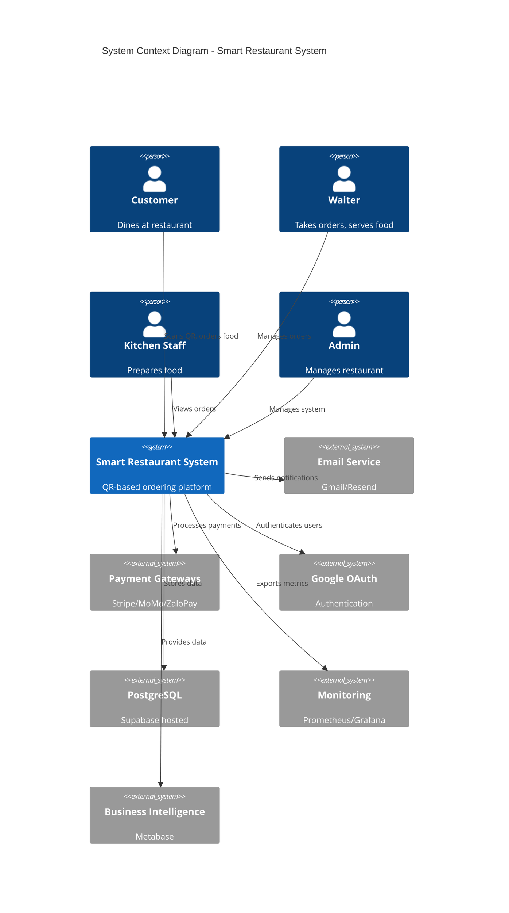
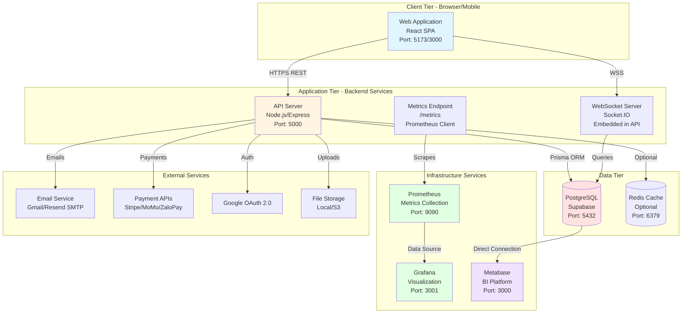
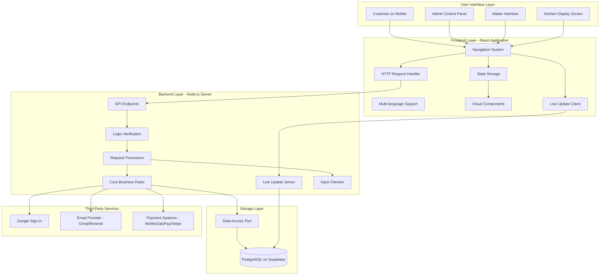
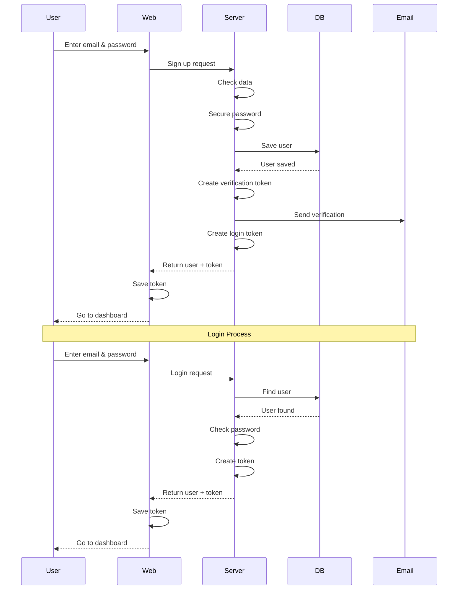
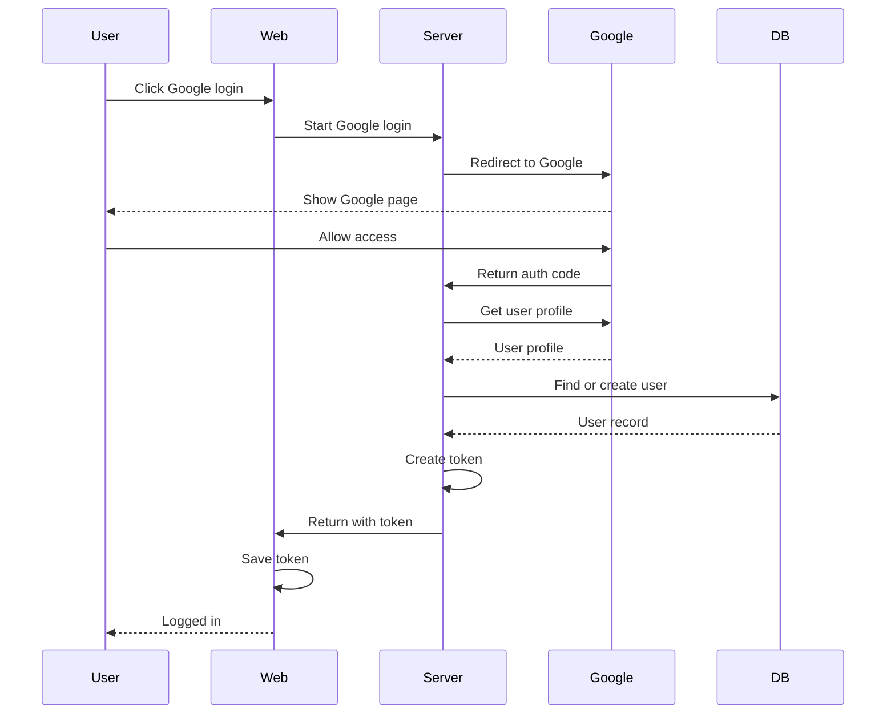
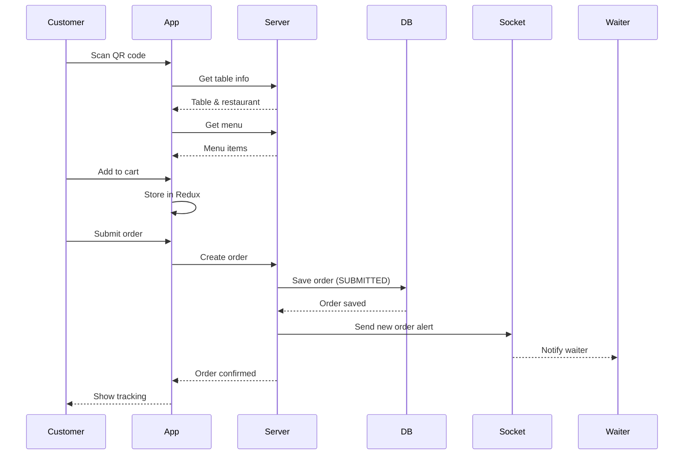
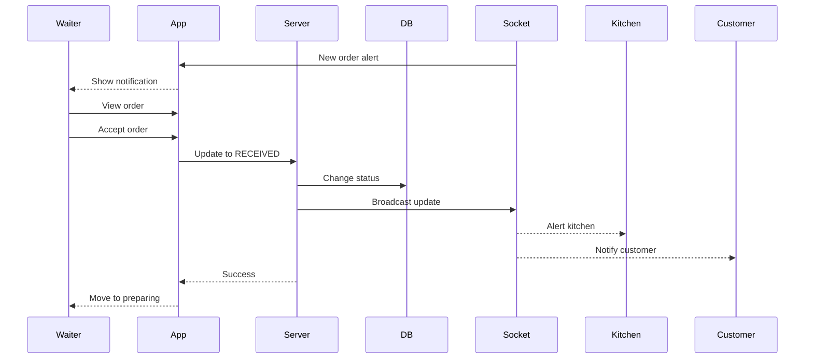
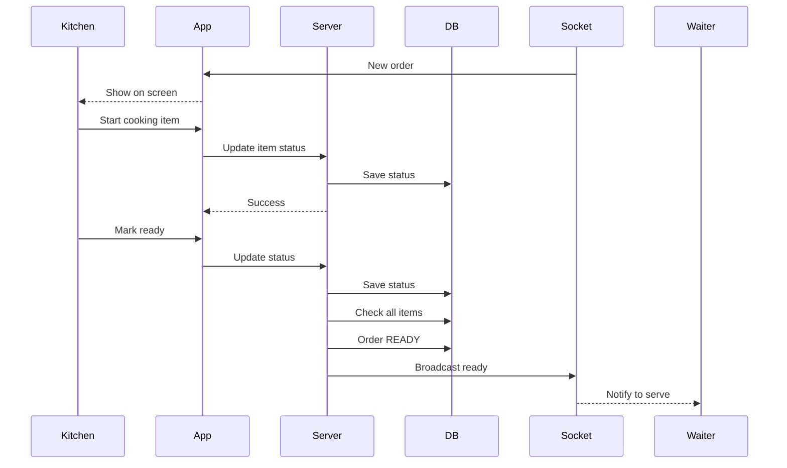

# System Architecture Documentation
## Smart Restaurant QR Ordering System

---

## Executive Summary

The Smart Restaurant QR Ordering System represents a comprehensive, enterprise-grade, full-stack web application designed to revolutionize the restaurant industry through contactless, QR code-based digital ordering. This system architecture document provides an in-depth technical overview of the entire platform, covering architectural patterns, technology choices, data flows, security implementations, and operational considerations.

**System Characteristics:**
- **Architecture Pattern**: Monolithic with microservice-ready design principles
- **Deployment Model**: Cloud-native, containerizable
- **Scalability**: Horizontal scaling capable with load balancing support
- **Multi-tenancy**: Restaurant-level isolation with shared infrastructure
- **Real-time Communication**: Event-driven architecture using WebSocket protocol
- **API Design**: RESTful with comprehensive OpenAPI documentation
- **Security Model**: OAuth 2.0, JWT-based authentication, role-based access control (RBAC)
- **Data Persistence**: PostgreSQL with ORM abstraction layer
- **Observability**: Integrated monitoring with Prometheus and Grafana

---

## Table of Contents

1. [System Overview](#1-system-overview)
2. [Architectural Principles & Design Patterns](#2-architectural-principles--design-patterns)
3. [High-Level System Architecture](#3-high-level-system-architecture)
4. [Technologies Used](#technologies-used)
5. [Frontend Structure](#frontend-structure)
6. [Backend Structure](#backend-structure)
7. [Database Design](#database-design)
8. [User Login System](#user-login-system)
9. [Order Workflow](#order-workflow)
10. [Real-Time System](#real-time-system)
11. [Deployment Setup](#deployment-setup)
12. [Security Measures](#security-measures)
13. [Growth Capacity](#growth-capacity)
14. [Related Documents](#related-documents)

---


## 1. System Overview

### 1.1 Vision & Purpose

The Smart Restaurant QR Ordering System is engineered to transform traditional restaurant operations by eliminating physical menus, reducing wait times, and minimizing human contact points. The platform provides a seamless, mobile-first ordering experience that empowers customers to browse menus, place orders, and complete payments entirely through their smartphones by scanning a table-mounted QR code.

**Core Value Propositions:**
- **For Customers**: Contactless ordering, real-time order tracking, multilingual support (English/Vietnamese), secure payment processing
- **For Restaurant Staff**: Streamlined order management, reduced order errors, real-time kitchen coordination, comprehensive analytics
- **For Restaurant Owners**: Multi-location support, data-driven insights, cost reduction, operational efficiency

### 1.2 System Scope

**In-Scope Features:**
- Customer-facing digital menu with QR code access
- Multi-role dashboards (Admin, Waiter, Kitchen Staff)
- Real-time order tracking and status updates
- Integrated payment gateway support (Stripe, MoMo, ZaloPay)
- Restaurant and menu management
- Table management with QR code generation
- Role-based access control and authentication
- Reporting and analytics
- Multi-language internationalization
- Email notifications and order confirmations
- Bill generation and printing
- Business intelligence integration (Metabase)
- System monitoring (Prometheus/Grafana)

**Out-of-Scope:**
- Inventory management system
- Employee scheduling and payroll
- Customer loyalty programs (future phase)
- Advanced reservation systems
- Integration with third-party delivery platforms

### 1.3 Key Stakeholders & User Roles

**Primary User Roles:**

1. **Customer (End User)**
   - Scans QR code to access restaurant menu
   - Places orders and makes payments
   - Tracks order status in real-time
   - Views order history

2. **Waiter (Service Staff)**
   - Receives and manages incoming orders
   - Creates and manages bills
   - Applies discounts and promotions
   - Coordinates between customers and kitchen
   - Processes payments

3. **Kitchen Staff**
   - Views incoming orders on kitchen display system
   - Updates order item statuses (preparing, ready)
   - Manages cooking workflow
   - Communicates readiness to service staff

4. **Admin (Restaurant Manager/Owner)**
   - Manages restaurant profile and settings
   - Creates and updates menu items and categories
   - Manages table assignments and QR codes
   - Views comprehensive reports and analytics
   - Manages user accounts and permissions
   - Configures system settings

5. **Super Admin (System Administrator)**
   - Manages multiple restaurants
   - System-wide configuration
   - User management across organizations

---

## 2. Architectural Principles & Design Patterns

### 2.1 Core Architectural Principles

**1. Separation of Concerns (SoC)**
- Clear separation between presentation (UI), business logic (services), and data access (repository) layers
- Each module has a single, well-defined responsibility
- Reduces coupling and increases cohesion

**2. Don't Repeat Yourself (DRY)**
- Reusable service modules and utility functions
- Shared UI components across different user interfaces
- Centralized configuration management

**3. SOLID Principles**
- **Single Responsibility**: Each class/module has one reason to change
- **Open/Closed**: Open for extension, closed for modification
- **Liskov Substitution**: Subtypes must be substitutable for their base types
- **Interface Segregation**: No client should depend on methods it doesn't use
- **Dependency Inversion**: Depend on abstractions, not concretions

**4. RESTful API Design**
- Resource-based URL structure
- Standard HTTP methods (GET, POST, PUT, PATCH, DELETE)
- Stateless communication
- Proper HTTP status codes
- HATEOAS principles where applicable

**5. Security by Design**
- Authentication and authorization at every layer
- Input validation and sanitization
- Principle of least privilege
- Defense in depth

### 2.2 Design Patterns Implemented

**Frontend Patterns:**

1. **Component Pattern (Atomic Design)**
   - Atoms: Button, Input, Badge, Icon
   - Molecules: FormField, MenuCard, OrderItem
   - Organisms: OrderList, MenuGrid, Dashboard widgets
   - Templates: Layout components
   - Pages: Complete views with data fetching

2. **Container/Presenter Pattern**
   - Smart components (containers) handle state and logic
   - Dumb components (presenters) handle UI rendering
   - Clear separation of concerns

3. **Higher-Order Components (HOC)**
   - `withAuth`: Authentication wrapper
   - `withLoading`: Loading state wrapper
   - `withErrorBoundary`: Error handling wrapper

4. **Service Layer Pattern**
   - Centralized API calls in service modules
   - Consistent error handling
   - Request/response transformation

**Backend Patterns:**

1. **MVC (Model-View-Controller) Variant**
   - Routes: Define endpoints (similar to View)
   - Controllers: Handle requests/responses
   - Services: Business logic (Model)
   - Prisma: Data access layer

2. **Repository Pattern**
   - Prisma ORM acts as repository layer
   - Abstracts database operations
   - Enables easy database migration

3. **Middleware Pattern**
   - Authentication middleware
   - Authorization middleware
   - Validation middleware
   - Error handling middleware
   - Logging middleware

4. **Strategy Pattern**
   - Multiple authentication strategies (JWT, OAuth)
   - Multiple payment gateway implementations
   - Pluggable notification services

5. **Singleton Pattern**
   - Single Prisma Client instance
   - Single Socket.IO server instance
   - Configuration objects

6. **Observer Pattern**
   - Socket.IO event-driven architecture
   - Real-time updates to connected clients
   - Pub/sub model for order notifications

---

## 3. High-Level System Architecture

### 3.1 System Context Diagram



### 3.2 Container Diagram



### 3.3 Component-Level Architecture

## System Architecture Diagram



**How Data Moves Through the System:**
1. **User Interface** → **Page Router** → **HTTP or WebSocket** → **Server API**
2. **Server** → **Database Tool** → **PostgreSQL Database**
3. **Live Updates**: **Database Update** → **Server** → **WebSocket** → **All Connected Users**

---

## Technologies Used

### Frontend Technologies
| Tool | Version | What It Does |
|------|---------|--------------|
| **React** | 18.2+ | Builds user interfaces |
| **Vite** | 5.0+ | Fast development server |
| **React Router DOM** | 6.20+ | Handles page navigation |
| **Redux Toolkit** | 2.6+ | Manages app-wide data |
| **TailwindCSS** | 3.4+ | Styles the interface quickly |
| **i18next** | 25.7+ | Translates text (English/Vietnamese) |
| **Axios** | 1.8+ | Makes HTTP requests |
| **Socket.IO Client** | 4.8+ | Handles real-time updates |
| **Framer Motion** | 10.16+ | Adds smooth animations |
| **Recharts** | 2.15+ | Creates data charts |
| **React Hook Form** | 7.55+ | Manages form inputs |
| **Lucide React** | 0.484+ | Provides icons |

### Backend Technologies
| Tool | Version | What It Does |
|------|---------|--------------|
| **Node.js** | 18+ | Runs JavaScript on server |
| **Express.js** | 4.18+ | Creates web server |
| **Prisma** | 5.8+ | Connects to database |
| **PostgreSQL** | 16+ | Stores all data |
| **Passport.js** | 0.7+ | Handles user login |
| **JWT** | 9.0+ | Creates secure tokens |
| **Socket.IO** | 4.6+ | Enables live updates |
| **Bcrypt.js** | 2.4+ | Secures passwords |
| **Nodemailer** | 7.0+ | Sends emails |
| **Helmet** | 7.1+ | Adds security |
| **Morgan** | 1.10+ | Logs requests |
| **Multer** | 1.4.5+ | Handles file uploads |
| **QRCode** | 1.5+ | Generates QR codes |
| **PDFKit** | 0.17+ | Creates PDF bills |
| **Swagger** | - | Documents APIs |

### Hosting Services
| Service | Purpose |
|---------|---------|
| **Supabase** | Hosts PostgreSQL database |
| **Render/Vercel** | Hosts backend and frontend |

---

## Frontend Structure

### File Organization
```
frontend/
├── src/
│   ├── components/       # Reusable parts
│   │   ├── ui/           # Basic elements (Button, Card)
│   │   ├── layout/       # Page structure (Header, Sidebar)
│   │   └── ...           # Feature-specific parts
│   ├── contexts/         # App-wide state
│   │   ├── AuthContext.jsx      # Login status
│   │   ├── LanguageContext.jsx  # Current language
│   │   └── SocketContext.jsx    # Live connection
│   ├── pages/            # Full pages by user type
│   │   ├── admin/        # Admin pages
│   │   ├── waiter/       # Waiter pages
│   │   ├── kitchen/      # Kitchen pages
│   │   ├── customer/     # Customer pages
│   │   └── auth/         # Login/register pages
│   ├── services/         # API calls
│   │   ├── api.js        # HTTP setup
│   │   ├── auth.service.js
│   │   ├── menu.service.js
│   │   ├── order.service.js
│   │   └── ...
│   ├── layouts/          # Page templates
│   │   ├── AdminLayout.jsx
│   │   ├── WaiterLayout.jsx
│   │   └── CustomerLayout.jsx
│   ├── i18n/             # Translations
│   │   ├── index.js      # Language setup
│   │   └── locales/      # Translation files
│   │       ├── en.json   # English
│   │       └── vi.json   # Vietnamese
│   ├── styles/           # CSS files
│   ├── utils/            # Helper functions
│   ├── Routes.jsx        # URL routing
│   ├── App.jsx           # Main component
│   └── index.jsx         # App entry
├── public/               # Static files
└── package.json
```

### Component Design

**Design Approach**: **Atomic Design** + **Feature Grouping**

1. **Atoms**: Smallest parts (Button, Input, Badge)
2. **Molecules**: Combined parts (FormField, MenuCard)
3. **Organisms**: Large sections (OrderList, MenuGrid)
4. **Templates**: Page layouts
5. **Pages**: Complete pages with logic

### Managing App State

**Redux Toolkit** for shared data:
- **Login Info**: User details, logged-in status
- **Shopping Cart**: Customer's selected items
- **Orders**: Current orders for staff
- **UI**: Popup windows, alerts, loading indicators

**React Context** for:
- Login session
- Language preference
- WebSocket connection

**React Hooks** for component-specific data

### Page Navigation

**React Router v6** with protected routes:

```javascript
/                           # Home page
/admin/login                # Admin login
/admin/dashboard            # Admin home
/admin/menu                 # Menu editor
/admin/tables               # Table manager
/admin/orders               # Order viewer
/admin/reports              # Business reports

/waiter/login               # Waiter login
/waiter/dashboard           # Waiter home
/waiter/orders              # Order management

/kitchen/login              # Kitchen login
/kitchen/dashboard          # Kitchen screen

/customer/register          # Sign up
/customer/login             # Customer login
/order/:qrCode              # Order via QR scan
/menu/:restaurantId         # Browse menu
```

**Access Control**:
- `ProtectedRoute` verifies user login
- Role checks redirect wrong user types

### Calling the Backend

**Axios Setup**:
- Server URL from environment (.env file)
- Auto-adds login token to requests
- Handles errors (logout on 401, show toast on 500)
- Transforms data format

**API Service Pattern**:
```javascript
// Example: menu.service.js
export const menuService = {
  getCategories: (restaurantId) => api.get(`/menu/${restaurantId}/categories`),
  getMenuItems: (restaurantId, params) => api.get(`/menu/${restaurantId}/items`, { params }),
  createMenuItem: (data) => api.post('/menu/items', data),
  // more methods...
};
```

### Live Updates

**Socket.IO** for instant notifications:
- **Order Alerts**: Waiters get new order notifications
- **Status Changes**: Everyone sees order updates
- **Kitchen Updates**: Live kitchen display

**Events**:
- `new_order` - Waiter sees new order
- `order_status_updated` - Status changed
- `order_accepted` - Customer sees confirmation

---

## Backend Structure

### File Organization
```
backend/
├── src/
│   ├── config/           # Settings
│   │   ├── database.js   # Database connection
│   │   └── passport.js   # Login methods
│   ├── controllers/      # Handle requests
│   │   ├── auth.controller.js
│   │   ├── menu.controller.js
│   │   ├── order.controller.js
│   │   ├── table.controller.js
│   │   └── ...
│   ├── routes/           # URL definitions
│   │   ├── auth.routes.js
│   │   ├── menu.routes.js
│   │   ├── order.routes.js
│   │   └── ...
│   ├── middlewares/      # Request filters
│   │   ├── auth.middleware.js     # Login check
│   │   └── errorHandler.js
│   ├── services/         # Core logic
│   │   ├── email.service.js
│   │   ├── payment.service.js
│   │   ├── qr.service.js
│   │   └── socket.service.js
│   └── utils/            # Helpers
│       ├── jwt.js
│       └── validators.js
├── prisma/               # Database
│   ├── schema.prisma     # Data structure
│   ├── migrations/       # Version history
│   └── seed.js           # Sample data
├── uploads/              # Uploaded images
├── server.js             # Main file
└── package.json
```

### Three-Layer Design

**How Requests Flow**:

```
┌──────────────────┐
│  Routes          │ ← URL endpoints
├──────────────────┤
│  Controllers     │ ← Handle requests
├──────────────────┤
│  Services        │ ← Business rules
├──────────────────┤
│  Prisma          │ ← Database access
├──────────────────┤
│  PostgreSQL      │ ← Data storage
└──────────────────┘
```

**What Each Layer Does**:

1. **Routes**:
   - Define URLs
   - Add security checks
   - Connect to controllers

2. **Controllers**:
   - Receive requests
   - Validate data
   - Call services
   - Send responses

3. **Services**:
   - Core business logic
   - Database operations
   - External API calls

4. **Prisma**:
   - Query database
   - Model data
   - Track changes

### Request Processing Steps

**How Requests are Handled**:
```
Request Arrives
  ↓
1. Security headers added
  ↓
2. CORS check
  ↓
3. Request logged
  ↓
4. Parse request body
  ↓
5. Check login (if needed)
  ↓
6. Check permissions
  ↓
7. Process request
  ↓
8. Handle errors
  ↓
Response Sent
```

### Login & Permissions

**Login Methods**:
1. **JWT**: Token-based
2. **Google OAuth**: Social login

**Middleware Functions**:
```javascript
// Check if logged in
protect(req, res, next)

// Check user role
authorize('ADMIN', 'WAITER')(req, res, next)
```

**Protected Route Example**:
```javascript
router.post('/menu/items',
  protect,                        // Must be logged in
  authorize('ADMIN'),             // Must be admin
  validate(menuItemSchema),       // Check input
  menuController.createMenuItem   // Process request
);
```

---

## Database Design

### Prisma Setup

**Connection Options**:
- **Pooled**: For normal use (port 6543)
- **Direct**: For migrations (port 5432)
- **Single Instance**: One client for whole app

**Environment Settings**:
```javascript
DATABASE_URL="postgresql://...pooler.supabase.com:6543/..." // Normal use
DIRECT_URL="postgresql://...pooler.supabase.com:5432/..."   // Migrations
```

**Query Tricks**:
- Load related data with `include`
- Select specific fields with `select`
- Paginate with `skip` and `take`
- Filter with `where`
- Sort with `orderBy`

**Query Example**:
```javascript
const orders = await prisma.order.findMany({
  where: {
    restaurantId,
    status: 'SUBMITTED'
  },
  include: {
    table: true,
    orderItems: {
      include: {
        menuItem: true
      }
    }
  },
  orderBy: { createdAt: 'desc' },
  take: 20,
  skip: (page - 1) * 20
});
```

### Multi-Restaurant Support

**Data Separation**: **Shared Database**

- All restaurants use same tables
- `restaurantId` links data to restaurants
- App ensures data isolation

**Advantages**:
- Easy to maintain
- Cost-effective
- Simple analytics

**Important**:
- Always filter by `restaurantId`
- Middleware checks restaurant access
- Must be careful to prevent data leaks

---

## User Login System

### Sign Up & Sign In



### Google Login



### Token Format

**Token Contents**:
```json
{
  "id": "user-uuid",
  "email": "user@example.com",
  "role": "WAITER",
  "restaurantId": "restaurant-uuid",
  "iat": 1705564800,
  "exp": 1706169600
}
```

**Token Settings**:
- Expires in 7 days
- Stored in browser localStorage
- Checked on every protected request

---

## Order Workflow

### Customer Places Order



### Waiter Processes Order



### Kitchen Prepares Food



---

## Real-Time System

### WebSocket Setup

**Server Code**:
```javascript
const io = require('socket.io')(server, {
  cors: {
    origin: process.env.FRONTEND_URL,
    credentials: true
  }
});

io.on('connection', (socket) => {
  console.log('Client connected:', socket.id);
  
  socket.on('join_restaurant', (restaurantId) => {
    socket.join(restaurantId);
  });
  
  socket.on('disconnect', () => {
    console.log('Client disconnected');
  });
});

// Share with controllers
app.set('io', io);
```

**Client Code** (React):
```javascript
import { io } from 'socket.io-client';

const socket = io(API_BASE_URL, {
  auth: { token: localStorage.getItem('token') }
});

socket.emit('join_restaurant', restaurantId);

socket.on('new_order', (order) => {
  // Handle new order
});
```

### Event Messages

| Event Name | Who Sends | Who Receives | Purpose |
|------------|-----------|--------------|---------|
| `new_order` | Server (on order create) | Restaurant waiters | Alert new order |
| `order_status_updated` | Server (on status change) | All users | Status changed |
| `order_accepted` | Server (waiter accept) | Customer, Kitchen | Order confirmed |
| `order_ready` | Server (kitchen done) | Waiter | Food ready |

### Broadcasting Messages

**Sending to Restaurant**:
```javascript
// Send to all in restaurant
io.to(restaurantId).emit('new_order', orderData);

// Send to specific role
io.to(`${restaurantId}_waiters`).emit('waiter_notification', data);
```

---

## Deployment Setup

### Development Mode

```
 ┌──────────────┐
 │   Developer  │
 └──────┬───────┘
        │
  ┌──── ▼──────┐
  │ Computer   │
  ├────────────┤
  │ React:5173 │
  │ Node:5000  │
  │ Prisma UI  │
  └────────────┘
        │
  ┌──── ▼──────┐
  │  Supabase  │
  │  Database  │
  └────────────┘
```

### Production Mode

```
┌────────────┐
│   Users    │
└─────┬──────┘
      │
┌─────▼──────┐
│   Vercel   │ ← React App
└─────┬──────┘
      │
┌─────▼──────┐
│   Render   │ ← Node Server
└─────┬──────┘
      │
┌─────▼──────┐
│  Supabase  │ ← Database
└────────────┘
```

**Hosting Choices**:
- **Frontend**: Vercel, Netlify, AWS
- **Backend**: Render, Heroku, Railway
- **Database**: Supabase

---

## Security Measures

### Login Security
- Passwords hashed 10 times with bcrypt
- Tokens expire after 7 days
- Email verification required
- Strong password rules

### Permission Control
- Role-based access (RBAC)
- Every route checks permissions
- Data isolated per restaurant
- No cross-restaurant access

### API Protection
- Security headers via Helmet
- CORS limits origins
- Input validation on all data
- SQL injection prevented by Prisma

### Data Protection
- Secrets in environment variables
- Database uses SSL
- File uploads limited to 5MB
- Only images allowed

### Frontend Protection
- React prevents XSS attacks
- Only token in localStorage
- HTTPS required in production
- Security headers configured

---

## Growth Capacity

### Current Limits
- One backend server only
- Limited database connections
- Files stored on server

### Future Upgrades
1. **More Servers**: Add multiple backend servers
2. **Cloud Storage**: Move files to AWS S3
3. **Caching**: Add Redis for speed
4. **CDN**: Fast file delivery
5. **Database**: Read-only copies for reports
6. **Microservices**: Split into smaller services

---

## Related Documents

- **Setup Instructions**: See [SETUP.md](../04-dev/SETUP.md)
- **API Guide**: See [API.md](../02-api/APIs.md)
- **Database Info**: See [DATABASE.md](../03-architecture/DATABASE_STRUCTURE.md)
