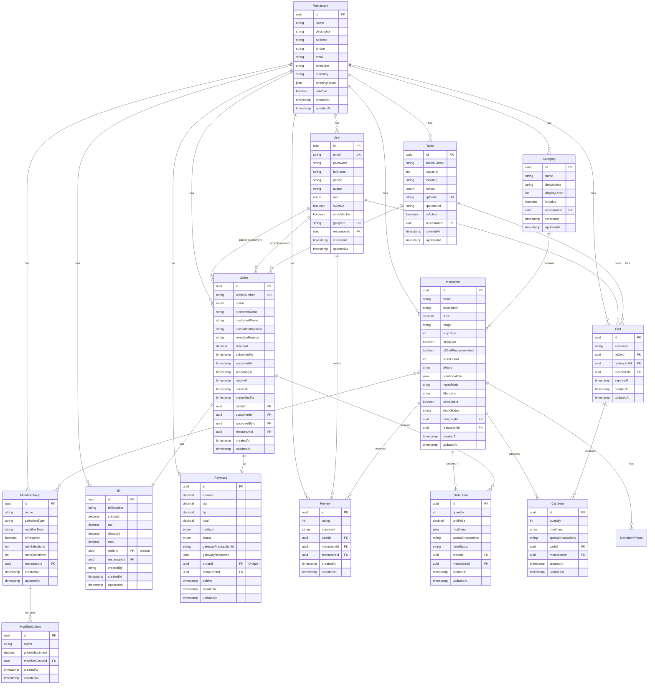

# Database Design - Smart Restaurant QR Ordering System

## Table of Contents
- [Overview](#overview)
- [Entity Relationship Diagram](#entity-relationship-diagram)
- [Database Schema](#database-schema)
- [Table Descriptions](#table-descriptions)
- [Relationships](#relationships)
- [Indexes](#indexes)
- [Enums](#enums)

---

## Overview

The Smart Restaurant system uses **PostgreSQL 16** as the database, managed through **Prisma ORM**. The database is hosted on **Supabase** cloud platform.

**Key Features:**
- Multi-tenant architecture (supports multiple restaurants)
- Role-based access control
- Real-time order tracking
- Comprehensive menu management with modifiers
- Payment and billing system
- Review and analytics support

---

## Entity Relationship Diagram



---

## Database Schema

### Core Tables

#### Restaurant
Multi-tenant table - each restaurant is isolated.

| Column | Type | Constraints | Description |
|--------|------|-------------|-------------|
| id | UUID | PRIMARY KEY | Unique identifier |
| name | VARCHAR | NOT NULL | Restaurant name |
| description | TEXT | - | Restaurant description |
| address | VARCHAR | - | Physical address |
| phone | VARCHAR | - | Contact phone |
| email | VARCHAR | - | Contact email |
| timezone | VARCHAR | DEFAULT 'Asia/Ho_Chi_Minh' | Timezone for operations |
| currency | VARCHAR | DEFAULT 'VND' | Currency code |
| openingHours | JSON | - | Business hours by day |
| isActive | BOOLEAN | DEFAULT true | Active status |
| createdAt | TIMESTAMP | DEFAULT now() | Creation timestamp |
| updatedAt | TIMESTAMP | AUTO UPDATE | Last update timestamp |

**Indexes:**
- `id` (PRIMARY KEY)
- `isActive`

---

#### User
Stores all user types (customers and staff).

| Column | Type | Constraints | Description |
|--------|------|-------------|-------------|
| id | UUID | PRIMARY KEY | Unique identifier |
| email | VARCHAR | UNIQUE, NOT NULL | User email |
| password | VARCHAR | - | Hashed password (nullable for OAuth) |
| fullName | VARCHAR | NOT NULL | Full name |
| phone | VARCHAR | - | Phone number |
| avatar | VARCHAR | - | Avatar image URL |
| role | ENUM | NOT NULL | User role |
| isActive | BOOLEAN | DEFAULT true | Account active status |
| emailVerified | BOOLEAN | DEFAULT false | Email verification status |
| googleId | VARCHAR | UNIQUE | Google OAuth ID |
| verificationToken | VARCHAR | - | Email verification token |
| resetPasswordToken | VARCHAR | - | Password reset token |
| resetPasswordExpire | TIMESTAMP | - | Reset token expiry |
| restaurantId | UUID | FOREIGN KEY | Restaurant association (null for customers) |
| createdAt | TIMESTAMP | DEFAULT now() | Creation timestamp |
| updatedAt | TIMESTAMP | AUTO UPDATE | Last update timestamp |

**Relationships:**
- `restaurantId` → Restaurant.id (CASCADE delete)
- One-to-Many: User → Orders (as customer)
- One-to-Many: User → Orders (as waiter who accepted)
- One-to-Many: User → Reviews

**Indexes:**
- `id` (PRIMARY KEY)
- `email` (UNIQUE)
- `googleId` (UNIQUE)
- `[restaurantId, role]` (composite)

---

#### Table
Restaurant tables with QR codes for customer ordering.

| Column | Type | Constraints | Description |
|--------|------|-------------|-------------|
| id | UUID | PRIMARY KEY | Unique identifier |
| tableNumber | VARCHAR | NOT NULL | Display number (e.g., "T01") |
| capacity | INTEGER | DEFAULT 4 | Seating capacity |
| location | VARCHAR | - | Physical location/floor |
| status | ENUM | DEFAULT AVAILABLE | Current status |
| isActive | BOOLEAN | DEFAULT true | Active status |
| qrCode | VARCHAR | UNIQUE | Unique QR token |
| qrCodeUrl | VARCHAR | - | URL to QR image |
| restaurantId | UUID | FOREIGN KEY | Restaurant association |
| createdAt | TIMESTAMP | DEFAULT now() | Creation timestamp |
| updatedAt | TIMESTAMP | AUTO UPDATE | Last update timestamp |

**Unique Constraints:**
- `[restaurantId, tableNumber]` - Each table number unique per restaurant

**Relationships:**
- `restaurantId` → Restaurant.id (CASCADE delete)

**Indexes:**
- `id` (PRIMARY KEY)
- `qrCode` (UNIQUE)
- `[restaurantId, tableNumber]` (UNIQUE composite)

---

### Menu Management Tables

#### Category
Menu categories for organizing items.

| Column | Type | Constraints | Description |
|--------|------|-------------|-------------|
| id | UUID | PRIMARY KEY | Unique identifier |
| name | VARCHAR | NOT NULL | Category name |
| description | TEXT | - | Category description |
| displayOrder | INTEGER | DEFAULT 0 | Sort order |
| isActive | BOOLEAN | DEFAULT true | Active status |
| restaurantId | UUID | FOREIGN KEY | Restaurant association |
| createdAt | TIMESTAMP | DEFAULT now() | Creation timestamp |
| updatedAt | TIMESTAMP | AUTO UPDATE | Last update timestamp |

**Indexes:**
- `[restaurantId, isActive]`

---

#### MenuItem
Individual menu items/dishes.

| Column | Type | Constraints | Description |
|--------|------|-------------|-------------|
| id | UUID | PRIMARY KEY | Unique identifier |
| name | VARCHAR | NOT NULL | Item name |
| description | TEXT | - | Item description |
| price | DECIMAL(10,2) | NOT NULL | Item price |
| image | VARCHAR | - | Primary image URL |
| prepTime | INTEGER | - | Preparation time (minutes) |
| isPopular | BOOLEAN | DEFAULT false | Popular item flag |
| isChefRecommended | BOOLEAN | DEFAULT false | Chef's recommendation |
| orderCount | INTEGER | DEFAULT 0 | Total times ordered |
| dietary | TEXT[] | - | Dietary tags (vegetarian, vegan, etc.) |
| nutritionalInfo | JSON | - | Nutrition facts |
| ingredients | TEXT[] | - | Ingredient list |
| allergens | TEXT[] | - | Allergen information |
| isAvailable | BOOLEAN | DEFAULT true | Available for ordering |
| stockStatus | VARCHAR | DEFAULT 'available' | Stock status |
| categoryId | UUID | FOREIGN KEY | Category association |
| restaurantId | UUID | FOREIGN KEY | Restaurant association |
| createdAt | TIMESTAMP | DEFAULT now() | Creation timestamp |
| updatedAt | TIMESTAMP | AUTO UPDATE | Last update timestamp |

**Indexes:**
- `[restaurantId, categoryId, isAvailable]`
- `[restaurantId, orderCount]` (for popular items)

---

#### MenuItemPhoto
Multiple photos for menu items.

| Column | Type | Constraints | Description |
|--------|------|-------------|-------------|
| id | UUID | PRIMARY KEY | Unique identifier |
| url | VARCHAR | NOT NULL | Image URL |
| isPrimary | BOOLEAN | DEFAULT false | Primary photo flag |
| menuItemId | UUID | FOREIGN KEY | Menu item association |
| createdAt | TIMESTAMP | DEFAULT now() | Creation timestamp |
| updatedAt | TIMESTAMP | AUTO UPDATE | Last update timestamp |

**Relationships:**
- `menuItemId` → MenuItem.id (CASCADE delete)

---

#### ModifierGroup
Groups of modifiers (e.g., "Spiciness Level", "Add Sides").

| Column | Type | Constraints | Description |
|--------|------|-------------|-------------|
| id | UUID | PRIMARY KEY | Unique identifier |
| name | VARCHAR | NOT NULL | Group name |
| selectionType | VARCHAR | NOT NULL | 'single' or 'multiple' |
| modifierType | VARCHAR | DEFAULT 'choice' | 'choice' or 'addon' |
| isRequired | BOOLEAN | DEFAULT false | Required selection |
| minSelections | INTEGER | DEFAULT 0 | Minimum selections |
| maxSelections | INTEGER | DEFAULT 1 | Maximum selections |
| restaurantId | UUID | FOREIGN KEY | Restaurant association |
| createdAt | TIMESTAMP | DEFAULT now() | Creation timestamp |
| updatedAt | TIMESTAMP | AUTO UPDATE | Last update timestamp |

**Modifier Types:**
- `choice` - Selection without quantity (e.g., "Mild" or "Hot")
- `addon` - Addition with quantity (e.g., "2x French Fries")

---

#### ModifierOption
Individual options within a modifier group.

| Column | Type | Constraints | Description |
|--------|------|-------------|-------------|
| id | UUID | PRIMARY KEY | Unique identifier |
| name | VARCHAR | NOT NULL | Option name |
| priceAdjustment | DECIMAL(10,2) | NOT NULL | Price modifier |
| modifierGroupId | UUID | FOREIGN KEY | Group association |
| createdAt | TIMESTAMP | DEFAULT now() | Creation timestamp |
| updatedAt | TIMESTAMP | AUTO UPDATE | Last update timestamp |

**Relationships:**
- `modifierGroupId` → ModifierGroup.id (CASCADE delete)

---

#### MenuItemModifierGroup
Junction table linking menu items to modifier groups (Many-to-Many).

| Column | Type | Constraints | Description |
|--------|------|-------------|-------------|
| menuItemId | UUID | PRIMARY KEY (composite) | Menu item ID |
| modifierGroupId | UUID | PRIMARY KEY (composite) | Modifier group ID |

---

### Order Management Tables

#### Order
Customer orders.

| Column | Type | Constraints | Description |
|--------|------|-------------|-------------|
| id | UUID | PRIMARY KEY | Unique identifier |
| orderNumber | VARCHAR | UNIQUE | Display order number |
| status | ENUM | DEFAULT SUBMITTED | Order status |
| customerName | VARCHAR | - | Customer name (for guests) |
| customerPhone | VARCHAR | - | Customer phone (for guests) |
| specialInstructions | TEXT | - | Order-level instructions |
| rejectionReason | TEXT | - | Reason if rejected |
| discount | DECIMAL(10,2) | DEFAULT 0 | Discount amount |
| submittedAt | TIMESTAMP | - | Submission time |
| acceptedAt | TIMESTAMP | - | Acceptance time |
| preparingAt | TIMESTAMP | - | Preparation start time |
| readyAt | TIMESTAMP | - | Ready time |
| servedAt | TIMESTAMP | - | Served time |
| completedAt | TIMESTAMP | - | Completion time |
| tableId | UUID | FOREIGN KEY | Table association |
| customerId | UUID | FOREIGN KEY | Customer (null for guests) |
| acceptedById | UUID | FOREIGN KEY | Waiter who accepted |
| restaurantId | UUID | FOREIGN KEY | Restaurant association |
| createdAt | TIMESTAMP | DEFAULT now() | Creation timestamp |
| updatedAt | TIMESTAMP | AUTO UPDATE | Last update timestamp |

**Unique Constraints:**
- `[restaurantId, orderNumber]`

**Indexes:**
- `[tableId, status]`
- `[restaurantId, status]`

**Relationships:**
- `tableId` → Table.id (CASCADE delete)
- `customerId` → User.id (SET NULL on delete)
- `acceptedById` → User.id (SET NULL on delete)
- `restaurantId` → Restaurant.id (CASCADE delete)

---

#### OrderItem
Individual items within an order.

| Column | Type | Constraints | Description |
|--------|------|-------------|-------------|
| id | UUID | PRIMARY KEY | Unique identifier |
| quantity | INTEGER | DEFAULT 1 | Item quantity |
| unitPrice | DECIMAL(10,2) | NOT NULL | Price at order time |
| modifiers | JSON | DEFAULT [] | Selected modifiers |
| specialInstructions | TEXT | - | Item-specific instructions |
| itemStatus | VARCHAR | DEFAULT 'queued' | Kitchen status |
| orderId | UUID | FOREIGN KEY | Order association |
| menuItemId | UUID | FOREIGN KEY | Menu item reference |
| createdAt | TIMESTAMP | DEFAULT now() | Creation timestamp |
| updatedAt | TIMESTAMP | AUTO UPDATE | Last update timestamp |

**Item Statuses:**
- `queued` - Waiting to be cooked
- `cooking` - Currently being prepared
- `ready` - Ready to serve
- `rejected` - Item rejected by kitchen

**Relationships:**
- `orderId` → Order.id (CASCADE delete)
- `menuItemId` → MenuItem.id (RESTRICT delete)

**Indexes:**
- `orderId`

---

#### Bill
Order billing information.

| Column | Type | Constraints | Description |
|--------|------|-------------|-------------|
| id | UUID | PRIMARY KEY | Unique identifier |
| billNumber | VARCHAR | NOT NULL | Display bill number |
| subtotal | DECIMAL(10,2) | NOT NULL | Items total |
| tax | DECIMAL(10,2) | NOT NULL | Tax amount |
| discount | DECIMAL(10,2) | DEFAULT 0 | Discount amount |
| total | DECIMAL(10,2) | NOT NULL | Final total |
| orderId | UUID | FOREIGN KEY, UNIQUE | Order association (1-to-1) |
| restaurantId | UUID | FOREIGN KEY | Restaurant association |
| createdBy | VARCHAR | - | Waiter ID who created bill |
| createdAt | TIMESTAMP | DEFAULT now() | Creation timestamp |
| updatedAt | TIMESTAMP | AUTO UPDATE | Last update timestamp |

**Relationships:**
- `orderId` → Order.id (CASCADE delete, UNIQUE 1-to-1)

**Indexes:**
- `[restaurantId, createdAt]`

---

#### Payment
Payment transactions.

| Column | Type | Constraints | Description |
|--------|------|-------------|-------------|
| id | UUID | PRIMARY KEY | Unique identifier |
| amount | DECIMAL(10,2) | NOT NULL | Payment amount |
| tax | DECIMAL(10,2) | DEFAULT 0 | Tax amount |
| tip | DECIMAL(10,2) | DEFAULT 0 | Tip amount |
| total | DECIMAL(10,2) | NOT NULL | Total paid |
| method | ENUM | NOT NULL | Payment method |
| status | ENUM | DEFAULT PENDING | Payment status |
| gatewayTransactionId | VARCHAR | - | External transaction ID |
| gatewayResponse | JSON | - | Payment gateway response |
| orderId | UUID | FOREIGN KEY, UNIQUE | Order association (1-to-1) |
| restaurantId | UUID | FOREIGN KEY | Restaurant association |
| paidAt | TIMESTAMP | - | Payment completion time |
| createdAt | TIMESTAMP | DEFAULT now() | Creation timestamp |
| updatedAt | TIMESTAMP | AUTO UPDATE | Last update timestamp |

**Relationships:**
- `orderId` → Order.id (CASCADE delete, UNIQUE 1-to-1)

**Indexes:**
- `[restaurantId, status]`

---

### Cart Management Tables

#### Cart
Shopping cart for customers.

| Column | Type | Constraints | Description |
|--------|------|-------------|-------------|
| id | UUID | PRIMARY KEY | Unique identifier |
| sessionId | VARCHAR | - | Session identifier |
| tableId | UUID | FOREIGN KEY | Table association |
| restaurantId | UUID | FOREIGN KEY | Restaurant association |
| customerId | UUID | FOREIGN KEY | Customer (null for guests) |
| expiresAt | TIMESTAMP | - | Cart expiration time |
| createdAt | TIMESTAMP | DEFAULT now() | Creation timestamp |
| updatedAt | TIMESTAMP | AUTO UPDATE | Last update timestamp |

**Unique Constraints:**
- `[tableId, sessionId]`

**Indexes:**
- `restaurantId`
- `customerId`

**Relationships:**
- `tableId` → Table.id (CASCADE delete)
- `customerId` → User.id (SET NULL on delete)

---

#### CartItem
Items in cart.

| Column | Type | Constraints | Description |
|--------|------|-------------|-------------|
| id | UUID | PRIMARY KEY | Unique identifier |
| quantity | INTEGER | DEFAULT 1 | Item quantity |
| modifiers | TEXT[] | - | Selected modifier IDs |
| specialInstructions | TEXT | - | Item instructions |
| cartId | UUID | FOREIGN KEY | Cart association |
| menuItemId | UUID | FOREIGN KEY | Menu item reference |
| createdAt | TIMESTAMP | DEFAULT now() | Creation timestamp |
| updatedAt | TIMESTAMP | AUTO UPDATE | Last update timestamp |

**Relationships:**
- `cartId` → Cart.id (CASCADE delete)
- `menuItemId` → MenuItem.id (CASCADE delete)

---

### Review System

#### Review
Customer reviews for menu items.

| Column | Type | Constraints | Description |
|--------|------|-------------|-------------|
| id | UUID | PRIMARY KEY | Unique identifier |
| rating | INTEGER | NOT NULL | Rating (1-5) |
| comment | TEXT | - | Review comment |
| userId | UUID | FOREIGN KEY | Customer who reviewed |
| menuItemId | UUID | FOREIGN KEY | Menu item reviewed |
| restaurantId | UUID | FOREIGN KEY | Restaurant association |
| createdAt | TIMESTAMP | DEFAULT now() | Creation timestamp |
| updatedAt | TIMESTAMP | AUTO UPDATE | Last update timestamp |

**Indexes:**
- `[menuItemId, rating]`
- `[restaurantId, createdAt]`

---

## Enums

### UserRole
```sql
enum UserRole {
  SUPER_ADMIN  -- System administrator
  ADMIN        -- Restaurant owner
  WAITER       -- Waiter staff
  KITCHEN      -- Kitchen staff
  CUSTOMER     -- Customer
}
```

### TableStatus
```sql
enum TableStatus {
  AVAILABLE  -- Ready for customers
  OCCUPIED   -- Currently in use
  RESERVED   -- Reserved for specific time
  CLEANING   -- Being cleaned
}
```

### OrderStatus
```sql
enum OrderStatus {
  DRAFT            -- In cart (not yet submitted)
  SUBMITTED        -- Customer submitted
  REJECTED         -- Waiter rejected
  RECEIVED         -- Waiter accepted
  PREPARING        -- Kitchen preparing
  READY            -- Ready to serve
  SERVED           -- Served to customer
  PAYMENT_PENDING  -- Bill requested
  COMPLETED        -- Payment completed
  CANCELLED        -- Order cancelled
}
```

### PaymentMethod
```sql
enum PaymentMethod {
  ZALOPAY
  MOMO
  VNPAY
  STRIPE
  CASH
  CARD_AT_COUNTER
}
```

### PaymentStatus
```sql
enum PaymentStatus {
  PENDING
  PROCESSING
  COMPLETED
  FAILED
  REFUNDED
}
```

---

## Relationships

### One-to-Many Relationships
- Restaurant → Users (1 restaurant has many staff)
- Restaurant → Categories (1 restaurant has many categories)
- Restaurant → MenuItems (1 restaurant has many menu items)
- Restaurant → Tables (1 restaurant has many tables)
- Restaurant → Orders (1 restaurant has many orders)
- Category → MenuItems (1 category has many items)
- Table → Orders (1 table can have many orders over time)
- User (Customer) → Orders (1 customer can place many orders)
- User (Waiter) → Orders (1 waiter can accept many orders)
- Order → OrderItems (1 order has many items)
- Cart → CartItems (1 cart has many items)
- ModifierGroup → ModifierOptions (1 group has many options)
- MenuItem → MenuItemPhotos (1 item has many photos)

### One-to-One Relationships
- Order ↔ Bill (1 order has 1 bill)
- Order ↔ Payment (1 order has 1 payment)

### Many-to-Many Relationships
- MenuItem ↔ ModifierGroup (via MenuItemModifierGroup junction table)
  - One menu item can have multiple modifier groups
  - One modifier group can be used by multiple menu items

---

## Indexes

Indexes are strategically placed to optimize common queries:

1. **User lookups**:
   - Email (unique index for authentication)
   - Restaurant + Role (for staff queries)

2. **Menu browsing**:
   - Restaurant + Category + Availability
   - Restaurant + Order Count (for popular items)

3. **Order management**:
   - Table + Status (for active orders)
   - Restaurant + Status (for dashboard)
   - Order items by order ID

4. **QR Code scanning**:
   - Table QR Code (unique index)

5. **Reports**:
   - Restaurant + Created At (for time-based reports)
   - Menu Item ratings

---

## Notes for Developers

### Database Migrations
Use Prisma to manage schema changes:

```bash
# Create migration
npx prisma migrate dev --name description_of_change

# Apply migrations
npx prisma migrate deploy

# Reset database (DEV ONLY)
npx prisma migrate reset
```

### Viewing Database
Use Prisma Studio for visual database browsing:

```bash
npx prisma studio
```

Opens at `http://localhost:5555`

### Performance Considerations
- Connection pooling is enabled via Supabase pooler
- Use `DATABASE_URL` (pooled) for most queries
- Use `DIRECT_URL` for migrations only
- Indexes are optimized for common query patterns

---

## Additional Resources

- **Prisma Schema**: `backend/prisma/schema.prisma`
- **API Documentation**: See [API.md](../02-api/APIs.md)
- **Setup Guide**: See [SETUP.md](../04-dev/SETUP.md)
