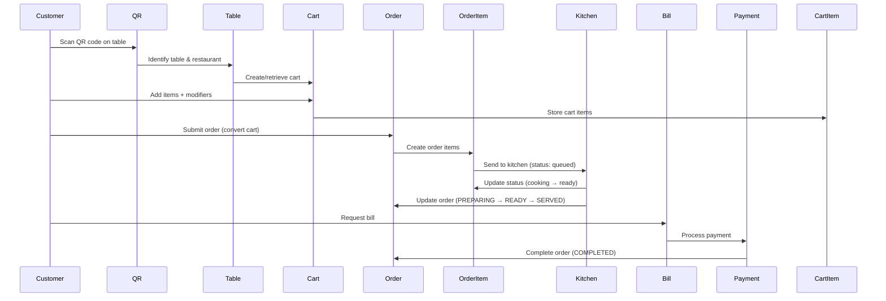
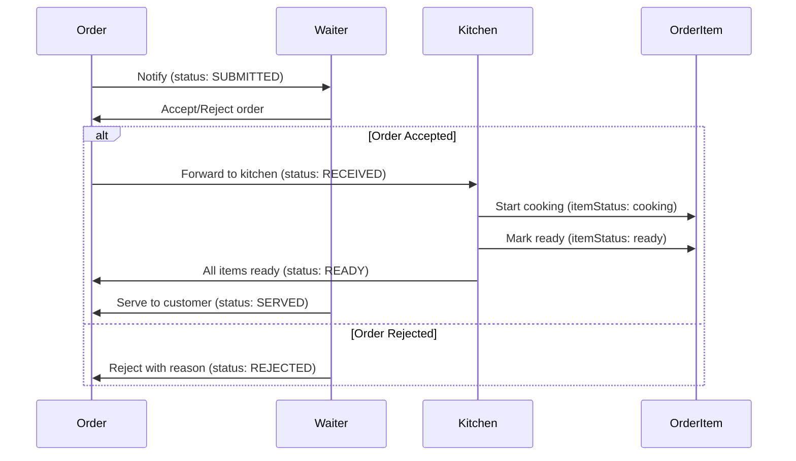
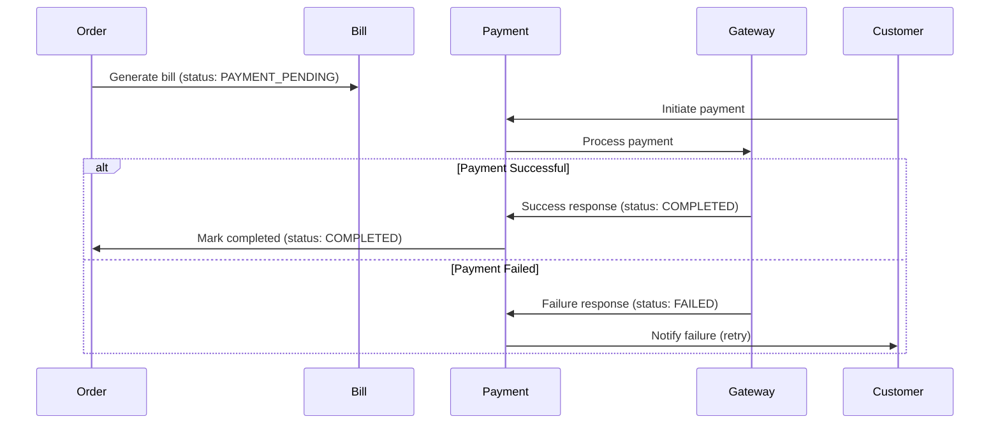
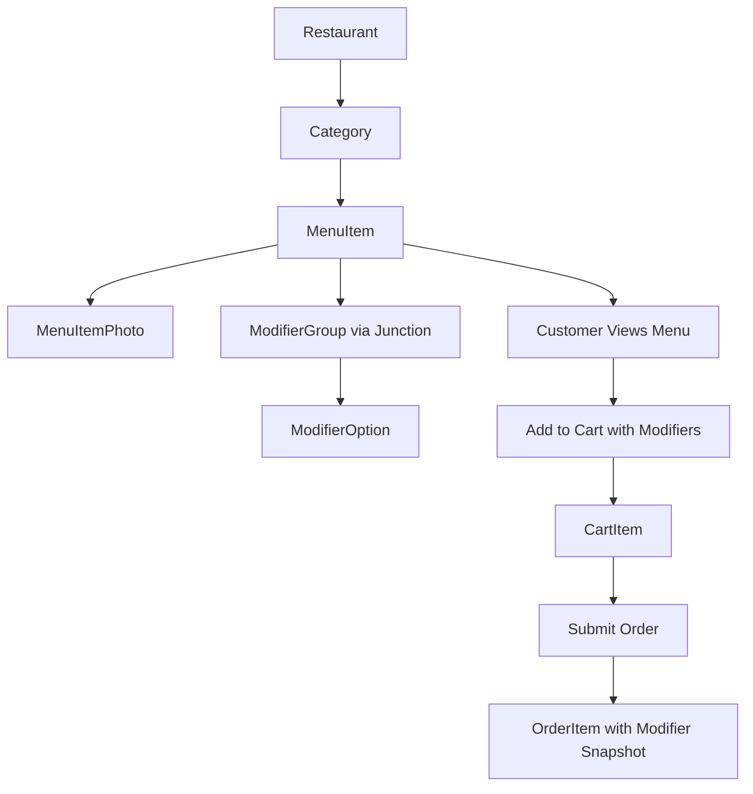

# Entity Relationship Diagram - Smart Restaurant QR Ordering System

> **Last Updated**: January 19, 2026  
> **Database**: PostgreSQL 16 with Prisma ORM  
> **Platform**: Supabase Cloud

## Table of Contents
- [Overview](#overview)
- [ER Diagram Visualization](#er-diagram-visualization)
- [Entity Descriptions](#entity-descriptions)
- [Relationship Mapping](#relationship-mapping)
- [Cardinality Details](#cardinality-details)
- [Constraints and Business Rules](#constraints-and-business-rules)
- [Data Flow](#data-flow)

---

## Overview

This document provides a comprehensive Entity Relationship (ER) diagram for the Smart Restaurant QR Ordering System. The database follows a **multi-tenant architecture** where each restaurant operates independently with its own data isolation while sharing the same database schema.

**Key Architectural Patterns:**
- **Multi-tenancy**: All major entities are scoped to a `restaurantId` for data isolation
- **Soft deletes**: Records maintain referential integrity with cascading rules
- **Audit trails**: All entities include `createdAt` and `updatedAt` timestamps
- **Status-driven workflows**: Orders, tables, and payments use enum-based state machines

---

## ER Diagram Visualization

### Complete System Diagram

```mermaid
erDiagram
    %% ============================================
    %% Core Restaurant & User Management
    %% ============================================
    
    Restaurant ||--o{ User : "employs staff"
    Restaurant ||--o{ Category : "organizes menu into"
    Restaurant ||--o{ MenuItem : "offers"
    Restaurant ||--o{ Table : "has"
    Restaurant ||--o{ Order : "receives"
    Restaurant ||--o{ ModifierGroup : "configures"
    Restaurant ||--o{ Cart : "manages"
    Restaurant ||--o{ Bill : "issues"
    Restaurant ||--o{ Payment : "processes"
    Restaurant ||--o{ Review : "receives"
    
    %% ============================================
    %% User Relationships
    %% ============================================
    
    User ||--o{ Order : "places as customer"
    User ||--o{ Order : "accepts as waiter"
    User ||--o{ Cart : "owns"
    User ||--o{ Review : "writes"
    
    %% ============================================
    %% Menu Management
    %% ============================================
    
    Category ||--o{ MenuItem : "contains"
    
    MenuItem ||--o{ OrderItem : "ordered in"
    MenuItem ||--o{ CartItem : "added to cart"
    MenuItem ||--o{ MenuItemPhoto : "has photos"
    MenuItem ||--o{ Review : "receives"
    MenuItem }o--o{ ModifierGroup : "has modifiers"
    
    ModifierGroup ||--o{ ModifierOption : "contains options"
    
    %% ============================================
    %% Table & Cart
    %% ============================================
    
    Table ||--o{ Order : "receives orders"
    Table ||--o{ Cart : "has active cart"
    
    Cart ||--o{ CartItem : "contains items"
    
    %% ============================================
    %% Order & Payment Flow
    %% ============================================
    
    Order ||--o{ OrderItem : "contains items"
    Order ||--|| Bill : "has one"
    Order ||--|| Payment : "has one"
    
    %% ============================================
    %% Entity Definitions
    %% ============================================
    
    Restaurant {
        uuid id PK "Primary key"
        string name "Restaurant name"
        string description "Description"
        string address "Physical address"
        string phone "Contact phone"
        string email "Contact email"
        string timezone "Default: Asia/Ho_Chi_Minh"
        string currency "Default: VND"
        json openingHours "Operating hours"
        boolean isActive "Active status"
        timestamp createdAt
        timestamp updatedAt
    }
    
    User {
        uuid id PK "Primary key"
        string email UK "Unique email"
        string password "Hashed (null for OAuth)"
        string fullName "Full name"
        string phone "Phone number"
        string avatar "Avatar URL"
        enum role "SUPER_ADMIN|ADMIN|WAITER|KITCHEN|CUSTOMER"
        boolean isActive "Account active"
        boolean emailVerified "Email verified"
        string googleId UK "Google OAuth ID"
        string verificationToken "Email verification"
        string resetPasswordToken "Password reset"
        timestamp resetPasswordExpire "Reset expiry"
        uuid restaurantId FK "Restaurant (null for customers)"
        timestamp createdAt
        timestamp updatedAt
    }
    
    Table {
        uuid id PK "Primary key"
        string tableNumber "Display number (T01)"
        int capacity "Seating capacity"
        string location "Floor/Zone"
        enum status "AVAILABLE|OCCUPIED|RESERVED|CLEANING"
        boolean isActive "Active status"
        string qrCode UK "Unique QR token"
        string qrCodeUrl "QR image URL"
        uuid restaurantId FK "Restaurant"
        timestamp createdAt
        timestamp updatedAt
    }
    
    Category {
        uuid id PK "Primary key"
        string name "Category name"
        string description "Description"
        int displayOrder "Sort order"
        boolean isActive "Active status"
        uuid restaurantId FK "Restaurant"
        timestamp createdAt
        timestamp updatedAt
    }
    
    MenuItem {
        uuid id PK "Primary key"
        string name "Item name"
        string description "Description"
        decimal price "Price (10,2)"
        string image "Image URL"
        int prepTime "Prep time (minutes)"
        boolean isPopular "Popular flag"
        boolean isChefRecommended "Chef's pick"
        int orderCount "Total orders"
        array dietary "Dietary tags"
        json nutritionalInfo "Nutrition facts"
        array ingredients "Ingredients list"
        array allergens "Allergens"
        boolean isAvailable "Available flag"
        string stockStatus "available|low-stock|out-of-stock"
        uuid categoryId FK "Category"
        uuid restaurantId FK "Restaurant"
        timestamp createdAt
        timestamp updatedAt
    }
    
    MenuItemPhoto {
        uuid id PK "Primary key"
        string url "Image URL"
        boolean isPrimary "Primary photo flag"
        uuid menuItemId FK "Menu item"
        timestamp createdAt
        timestamp updatedAt
    }
    
    ModifierGroup {
        uuid id PK "Primary key"
        string name "Group name"
        string selectionType "single|multiple"
        string modifierType "choice|addon"
        boolean isRequired "Required flag"
        int minSelections "Minimum selections"
        int maxSelections "Maximum selections"
        uuid restaurantId FK "Restaurant"
        timestamp createdAt
        timestamp updatedAt
    }
    
    ModifierOption {
        uuid id PK "Primary key"
        string name "Option name"
        decimal priceAdjustment "Price adjustment (10,2)"
        uuid modifierGroupId FK "Modifier group"
        timestamp createdAt
        timestamp updatedAt
    }
    
    MenuItemModifierGroup {
        uuid menuItemId PK_FK "Menu item"
        uuid modifierGroupId PK_FK "Modifier group"
    }
    
    Cart {
        uuid id PK "Primary key"
        string sessionId "Session ID"
        uuid tableId FK "Table"
        uuid restaurantId FK "Restaurant"
        uuid customerId FK "Customer (null for guests)"
        timestamp expiresAt "Cart expiry"
        timestamp createdAt
        timestamp updatedAt
    }
    
    CartItem {
        uuid id PK "Primary key"
        int quantity "Item quantity"
        array modifiers "Selected modifier IDs"
        string specialInstructions "Item notes"
        uuid cartId FK "Cart"
        uuid menuItemId FK "Menu item"
        timestamp createdAt
        timestamp updatedAt
    }
    
    Order {
        uuid id PK "Primary key"
        string orderNumber UK "Display number (ORD-0051)"
        enum status "Order state"
        string customerName "Guest name"
        string customerPhone "Guest phone"
        string specialInstructions "Order notes"
        string rejectionReason "Rejection reason"
        decimal discount "Discount amount (10,2)"
        timestamp submittedAt "Submission time"
        timestamp acceptedAt "Acceptance time"
        timestamp preparingAt "Prep start time"
        timestamp readyAt "Ready time"
        timestamp servedAt "Served time"
        timestamp completedAt "Completion time"
        uuid tableId FK "Table"
        uuid customerId FK "Customer (null for guests)"
        uuid acceptedById FK "Waiter"
        uuid restaurantId FK "Restaurant"
        timestamp createdAt
        timestamp updatedAt
    }
    
    OrderItem {
        uuid id PK "Primary key"
        int quantity "Item quantity"
        decimal unitPrice "Price at order time (10,2)"
        json modifiers "Selected modifiers JSON"
        string specialInstructions "Item notes"
        string itemStatus "queued|cooking|ready|rejected"
        uuid orderId FK "Order"
        uuid menuItemId FK "Menu item"
        timestamp createdAt
        timestamp updatedAt
    }
    
    Bill {
        uuid id PK "Primary key"
        string billNumber "Display number (BILL-1234)"
        decimal subtotal "Items total (10,2)"
        decimal tax "Tax amount (10,2)"
        decimal discount "Discount amount (10,2)"
        decimal total "Final total (10,2)"
        uuid orderId UK_FK "Order (1-to-1)"
        uuid restaurantId FK "Restaurant"
        string createdBy "Waiter ID"
        timestamp createdAt
        timestamp updatedAt
    }
    
    Payment {
        uuid id PK "Primary key"
        decimal amount "Payment amount (10,2)"
        decimal tax "Tax amount (10,2)"
        decimal tip "Tip amount (10,2)"
        decimal total "Total paid (10,2)"
        enum method "ZALOPAY|MOMO|VNPAY|STRIPE|CASH|CARD_AT_COUNTER"
        enum status "PENDING|PROCESSING|COMPLETED|FAILED|REFUNDED"
        string gatewayTransactionId "External transaction ID"
        json gatewayResponse "Gateway response"
        uuid orderId UK_FK "Order (1-to-1)"
        uuid restaurantId FK "Restaurant"
        timestamp paidAt "Payment time"
        timestamp createdAt
        timestamp updatedAt
    }
    
    Review {
        uuid id PK "Primary key"
        int rating "Rating 1-5"
        string comment "Review text"
        uuid userId FK "User"
        uuid menuItemId FK "Menu item"
        uuid restaurantId FK "Restaurant"
        timestamp createdAt
        timestamp updatedAt
    }
```

---

## Entity Descriptions

### Core Entities

#### **Restaurant** (Multi-tenant Root)
The root entity for multi-tenancy. Each restaurant is completely isolated with its own menu, tables, orders, and staff.

**Attributes:**
- `id` (PK): UUID primary key
- `name`: Restaurant name (required)
- `description`: Optional detailed description
- `address`, `phone`, `email`: Contact information
- `timezone`: Default "Asia/Ho_Chi_Minh" for date/time operations
- `currency`: Default "VND" for pricing
- `openingHours`: JSON object storing business hours per day
- `isActive`: Boolean for enabling/disabling restaurant

**Business Rules:**
- All restaurant data is isolated by `restaurantId` foreign key
- Deleting a restaurant cascades to all related entities
- Opening hours format: `{"monday": {"open": "08:00", "close": "22:00"}, ...}`

---

#### **User** (Multi-role Entity)
Stores all user types: customers, staff (waiters, kitchen), and admins. Role-based access control (RBAC) is implemented through the `role` enum.

**Attributes:**
- `id` (PK): UUID primary key
- `email` (UNIQUE): Authentication identifier
- `password`: Bcrypt hashed password (nullable for OAuth users)
- `fullName`, `phone`, `avatar`: Profile information
- `role`: SUPER_ADMIN | ADMIN | WAITER | KITCHEN | CUSTOMER
- `isActive`: Account status (for banning/suspending)
- `emailVerified`: Email verification status
- `googleId` (UNIQUE): Google OAuth identifier
- `verificationToken`: Token for email verification
- `resetPasswordToken`, `resetPasswordExpire`: Password reset flow
- `restaurantId` (FK): Null for SUPER_ADMIN and CUSTOMER roles

**Relationships:**
- **As Customer**: Creates Orders, Carts, Reviews
- **As Waiter**: Accepts Orders (acceptedById foreign key)
- **As Staff**: Belongs to a Restaurant

**Business Rules:**
- CUSTOMER and SUPER_ADMIN have `restaurantId = null`
- ADMIN, WAITER, KITCHEN must have `restaurantId` set
- Email must be unique across all users
- OAuth users (Google) have `password = null`

---

#### **Table** (QR Code Entry Point)
Physical tables in the restaurant with QR codes for customer self-ordering.

**Attributes:**
- `id` (PK): UUID primary key
- `tableNumber`: Display identifier (e.g., "T01", "A5")
- `capacity`: Number of seats
- `location`: Zone or floor description
- `status`: AVAILABLE | OCCUPIED | RESERVED | CLEANING
- `qrCode` (UNIQUE): Unique token embedded in QR code
- `qrCodeUrl`: URL to generated QR code image
- `isActive`: Active/inactive flag
- `restaurantId` (FK): Restaurant ownership

**Unique Constraints:**
- `[restaurantId, tableNumber]`: Each table number unique per restaurant

**Business Rules:**
- QR code scanning leads to: `/menu/:restaurantId/:tableId/:qrCode`
- Status transitions: AVAILABLE → OCCUPIED (order placed) → CLEANING → AVAILABLE
- Tables can be disabled without deletion (`isActive = false`)

---

### Menu Management Entities

#### **Category**
Organizes menu items into logical groups (e.g., "Appetizers", "Main Course", "Drinks").

**Attributes:**
- `id` (PK): UUID primary key
- `name`: Category name
- `description`: Optional description
- `displayOrder`: Integer for sorting (0 = first)
- `isActive`: Visibility flag
- `restaurantId` (FK): Restaurant ownership

**Business Rules:**
- Categories display in ascending `displayOrder`
- Inactive categories are hidden from customer menu
- Deleting a category cascades to menu items

---

#### **MenuItem**
Individual dishes or products on the menu.

**Attributes:**
- `id` (PK): UUID primary key
- `name`: Item name
- `description`: Detailed description
- `price`: Decimal(10,2) base price
- `image`: Primary image URL
- `prepTime`: Estimated preparation time (minutes)
- `isPopular`, `isChefRecommended`: Highlighting flags
- `orderCount`: Tracks popularity (incremented on each order)
- `dietary`: Array of tags (e.g., `["vegetarian", "gluten-free"]`)
- `nutritionalInfo`: JSON object with nutrition facts
- `ingredients`: Array of ingredient names
- `allergens`: Array of allergen warnings
- `isAvailable`: Order-able flag
- `stockStatus`: "available" | "low-stock" | "out-of-stock"
- `categoryId` (FK): Category
- `restaurantId` (FK): Restaurant

**Business Rules:**
- Price is base price before modifiers
- Out-of-stock items cannot be ordered (`isAvailable = false`)
- `orderCount` increments atomically on order confirmation
- Nutritional info format: `{"calories": 450, "protein": "42g", ...}`

---

#### **MenuItemPhoto**
Multiple photos for a single menu item.

**Attributes:**
- `id` (PK): UUID primary key
- `url`: Image URL
- `isPrimary`: Flag for main display photo
- `menuItemId` (FK): Menu item

**Business Rules:**
- One photo per menu item should have `isPrimary = true`
- Deleting menu item cascades to photos

---

#### **ModifierGroup**
Groups of modifiers (e.g., "Spice Level", "Add-ons", "Size").

**Attributes:**
- `id` (PK): UUID primary key
- `name`: Group name (e.g., "Spice Level")
- `selectionType`: "single" (radio) | "multiple" (checkbox)
- `modifierType`: "choice" (selection) | "addon" (with quantity)
- `isRequired`: Must select at least one
- `minSelections`: Minimum selections (default 0)
- `maxSelections`: Maximum selections (default 1)
- `restaurantId` (FK): Restaurant

**Business Rules:**
- **Choice modifiers**: Select without quantity (e.g., "Mild", "Hot", "Extra Hot")
- **Addon modifiers**: Select with quantity (e.g., "2x Fries", "3x Sauce")
- Validation: `minSelections ≤ selections ≤ maxSelections`

---

#### **ModifierOption**
Individual options within a modifier group.

**Attributes:**
- `id` (PK): UUID primary key
- `name`: Option name (e.g., "Extra Cheese")
- `priceAdjustment`: Price modifier (can be negative for discounts)
- `modifierGroupId` (FK): Parent group

**Business Rules:**
- Final item price = base price + sum of selected modifier adjustments
- Deleting a group cascades to options

---

#### **MenuItemModifierGroup** (Junction Table)
Many-to-Many relationship between MenuItem and ModifierGroup.

**Composite Primary Key:**
- `[menuItemId, modifierGroupId]`

**Business Rules:**
- One menu item can have multiple modifier groups
- One modifier group can be reused across multiple items
- Example: "Spice Level" modifier group applied to all curries

---

### Cart Management Entities

#### **Cart**
Shopping cart for customers before order submission.

**Attributes:**
- `id` (PK): UUID primary key
- `sessionId`: Browser session identifier (for guest tracking)
- `tableId` (FK): Table being ordered from
- `restaurantId` (FK): Restaurant
- `customerId` (FK): Nullable for guest vs. logged-in users
- `expiresAt`: Optional cart expiration timestamp

**Unique Constraints:**
- `[tableId, sessionId]`: One cart per session per table

**Business Rules:**
- Guest carts use `sessionId`, registered users use `customerId`
- Expired carts can be auto-purged by background job
- Converting cart to order clears cart items

---

#### **CartItem**
Individual items in the cart.

**Attributes:**
- `id` (PK): UUID primary key
- `quantity`: Number of items
- `modifiers`: Array of modifier option IDs (String[])
- `specialInstructions`: Custom notes
- `cartId` (FK): Cart
- `menuItemId` (FK): Menu item

**Business Rules:**
- Modifiers are stored as simple ID array (resolved on order conversion)
- Duplicate items with same modifiers increment quantity
- Deleting cart cascades to cart items

---

### Order Management Entities

#### **Order**
Customer orders submitted to the restaurant.

**Attributes:**
- `id` (PK): UUID primary key
- `orderNumber` (UNIQUE): Display number (e.g., "ORD-0051")
- `status`: OrderStatus enum (state machine)
- `customerName`, `customerPhone`: Guest customer info
- `specialInstructions`: Order-level notes
- `rejectionReason`: Reason if waiter rejects
- `discount`: Applied discount amount
- `submittedAt`, `acceptedAt`, `preparingAt`, `readyAt`, `servedAt`, `completedAt`: Timestamps
- `tableId` (FK): Table
- `customerId` (FK): Nullable for guest orders
- `acceptedById` (FK): Waiter who accepted order
- `restaurantId` (FK): Restaurant

**OrderStatus Flow:**
```
DRAFT → SUBMITTED → RECEIVED → PREPARING → READY → SERVED → PAYMENT_PENDING → COMPLETED
         ↓
      REJECTED
         ↓
      CANCELLED
```

**Unique Constraints:**
- `[restaurantId, orderNumber]`: Unique order number per restaurant

**Business Rules:**
- Order numbers auto-generate (e.g., "ORD-0051")
- Guest orders have `customerId = null` but include `customerName` and `customerPhone`
- Timestamps track order lifecycle for analytics
- Rejecting order requires `rejectionReason`

---

#### **OrderItem**
Line items within an order.

**Attributes:**
- `id` (PK): UUID primary key
- `quantity`: Number of items
- `unitPrice`: Price snapshot at order time (immutable)
- `modifiers`: JSON array of modifier objects
- `specialInstructions`: Item-specific notes
- `itemStatus`: "queued" | "cooking" | "ready" | "rejected"
- `orderId` (FK): Order
- `menuItemId` (FK): Menu item (RESTRICT delete)

**Modifier JSON Format:**
```json
[
  {
    "id": "mod-uuid",
    "name": "Extra Cheese",
    "quantity": 2,
    "priceAdjustment": 10000
  }
]
```

**Business Rules:**
- `unitPrice` is immutable (captures price at order time)
- Menu item price changes don't affect existing orders
- Modifiers stored as full JSON (denormalized for immutability)
- Kitchen tracks `itemStatus` independently

---

#### **Bill**
Billing information generated from an order.

**Attributes:**
- `id` (PK): UUID primary key
- `billNumber`: Display number (e.g., "BILL-1234")
- `subtotal`: Sum of all order items
- `tax`: Calculated tax amount
- `discount`: Applied discounts
- `total`: Final amount (subtotal + tax - discount)
- `orderId` (FK, UNIQUE): One-to-one with Order
- `restaurantId` (FK): Restaurant
- `createdBy`: Waiter ID who generated bill

**Business Rules:**
- One bill per order (1-to-1 relationship)
- Bill generation triggers `Order.status = PAYMENT_PENDING`
- Tax calculation based on restaurant settings
- Immutable after creation

---

#### **Payment**
Payment transaction records.

**Attributes:**
- `id` (PK): UUID primary key
- `amount`: Base payment amount
- `tax`: Tax amount
- `tip`: Customer tip
- `total`: Total paid (amount + tax + tip)
- `method`: ZALOPAY | MOMO | VNPAY | STRIPE | CASH | CARD_AT_COUNTER
- `status`: PENDING | PROCESSING | COMPLETED | FAILED | REFUNDED
- `gatewayTransactionId`: External payment gateway transaction ID
- `gatewayResponse`: Full JSON response from gateway
- `orderId` (FK, UNIQUE): One-to-one with Order
- `restaurantId` (FK): Restaurant
- `paidAt`: Timestamp of successful payment

**Payment Flow:**
```
PENDING → PROCESSING → COMPLETED
          ↓
        FAILED
          ↓
        (retry or cancel)
```

**Business Rules:**
- One payment per order (1-to-1 relationship)
- Successful payment sets `Order.status = COMPLETED`
- Gateway responses stored for audit and reconciliation
- Refunds create new payment records with `status = REFUNDED`

---

#### **Review**
Customer reviews for menu items.

**Attributes:**
- `id` (PK): UUID primary key
- `rating`: Integer 1-5
- `comment`: Optional text review
- `userId` (FK): User who wrote review
- `menuItemId` (FK): Menu item being reviewed
- `restaurantId` (FK): Restaurant

**Business Rules:**
- Rating must be between 1 and 5
- Users can review items after ordering
- Average ratings calculated on demand

---

## Relationship Mapping

### One-to-Many Relationships

| Parent Entity | Child Entity | Relationship | Cascade |
|--------------|--------------|--------------|---------|
| Restaurant | User | Employs staff | CASCADE |
| Restaurant | Category | Organizes menu | CASCADE |
| Restaurant | MenuItem | Offers items | CASCADE |
| Restaurant | Table | Has tables | CASCADE |
| Restaurant | Order | Receives orders | CASCADE |
| Restaurant | ModifierGroup | Configures modifiers | CASCADE |
| Restaurant | Cart | Manages carts | CASCADE |
| Restaurant | Bill | Issues bills | CASCADE |
| Restaurant | Payment | Processes payments | CASCADE |
| Restaurant | Review | Receives reviews | CASCADE |
| User (Customer) | Order | Places orders | SET NULL |
| User (Waiter) | Order | Accepts orders | SET NULL |
| User | Cart | Owns carts | SET NULL |
| User | Review | Writes reviews | CASCADE |
| Category | MenuItem | Contains items | CASCADE |
| Table | Order | Receives orders | CASCADE |
| Table | Cart | Has carts | CASCADE |
| MenuItem | OrderItem | Ordered in | RESTRICT |
| MenuItem | CartItem | Added to cart | CASCADE |
| MenuItem | MenuItemPhoto | Has photos | CASCADE |
| MenuItem | Review | Receives reviews | CASCADE |
| ModifierGroup | ModifierOption | Contains options | CASCADE |
| Cart | CartItem | Contains items | CASCADE |
| Order | OrderItem | Contains items | CASCADE |

### One-to-One Relationships

| Entity A | Entity B | Description |
|----------|----------|-------------|
| Order | Bill | Each order has exactly one bill |
| Order | Payment | Each order has exactly one payment |

### Many-to-Many Relationships

| Entity A | Entity B | Junction Table | Description |
|----------|----------|----------------|-------------|
| MenuItem | ModifierGroup | MenuItemModifierGroup | Items can have multiple modifier groups; groups can be reused across items |

---

## Cardinality Details

### Restaurant → Related Entities
- **1 Restaurant : N Users** (1 restaurant employs many staff)
- **1 Restaurant : N Tables** (1 restaurant has many tables)
- **1 Restaurant : N Orders** (1 restaurant receives many orders)
- **1 Restaurant : N Categories** (1 restaurant organizes menu into many categories)
- **1 Restaurant : N MenuItems** (1 restaurant offers many menu items)

### User → Orders
- **1 User (Customer) : N Orders** (1 customer places many orders)
- **1 User (Waiter) : N Orders** (1 waiter accepts many orders)
- Note: These are separate foreign keys (`customerId` and `acceptedById`)

### Order → OrderItem
- **1 Order : N OrderItems** (1 order contains many line items)

### MenuItem → ModifierGroup
- **M MenuItems : N ModifierGroups** (many-to-many via junction table)
- Example: "Spice Level" modifier group applied to 10 different curries

### Order → Bill → Payment
- **1 Order : 1 Bill : 1 Payment** (1-to-1-to-1 cascade)

---

## Constraints and Business Rules

### Unique Constraints

| Table | Columns | Purpose |
|-------|---------|---------|
| User | email | One account per email |
| User | googleId | One account per Google OAuth ID |
| Table | qrCode | Unique QR token per table |
| Table | [restaurantId, tableNumber] | Unique table numbers within restaurant |
| Order | [restaurantId, orderNumber] | Unique order numbers within restaurant |
| Cart | [tableId, sessionId] | One cart per session per table |
| Bill | orderId | One bill per order |
| Payment | orderId | One payment per order |
| MenuItemModifierGroup | [menuItemId, modifierGroupId] | No duplicate modifier assignments |

### Indexes for Performance

| Table | Index | Purpose |
|-------|-------|---------|
| User | email | Authentication lookup |
| User | [restaurantId, role] | Staff queries |
| Table | qrCode | QR code scanning |
| MenuItem | [restaurantId, categoryId, isAvailable] | Menu browsing |
| MenuItem | [restaurantId, orderCount] | Popular items |
| Order | [tableId, status] | Active orders by table |
| Order | [restaurantId, status] | Dashboard queries |
| OrderItem | orderId | Order detail retrieval |
| Bill | [restaurantId, createdAt] | Financial reports |
| Payment | [restaurantId, status] | Payment tracking |
| Review | [menuItemId, rating] | Menu item ratings |
| Cart | restaurantId | Cart management |
| Cart | customerId | User cart lookup |

### Referential Integrity Rules

#### CASCADE Deletes
- Deleting **Restaurant** cascades to all owned entities (users, tables, orders, etc.)
- Deleting **Order** cascades to order items, bill, and payment
- Deleting **MenuItem** cascades to photos and cart items (but RESTRICTS if in orders)

#### SET NULL Deletes
- Deleting **User (Customer)** sets `Order.customerId = null` (preserves order history)
- Deleting **User (Waiter)** sets `Order.acceptedById = null` (preserves order history)

#### RESTRICT Deletes
- **MenuItem** cannot be deleted if referenced in any orders
- Ensures order history remains intact

---

## Data Flow

### Customer Ordering Flow



### Staff Order Management Flow



### Payment Flow



### Menu Management Flow



---

## Additional Notes

### Multi-Tenancy Implementation
- All major tables include `restaurantId` foreign key
- Queries always filter by `WHERE restaurantId = :restaurantId`
- Data isolation enforced at application layer
- Supabase Row Level Security (RLS) can add additional database-level isolation

### Immutability Patterns
- **OrderItem.unitPrice**: Captures price at order time (menu price changes don't affect orders)
- **OrderItem.modifiers**: Full JSON snapshot of selected modifiers
- **Bill**: Immutable after creation
- **Payment.gatewayResponse**: Audit trail for payment reconciliation

### Soft Delete Considerations
- `isActive` flags used for Restaurant, Table, Category, MenuItem
- Allows "archiving" without data loss
- Inactive entities excluded from public queries

### Audit Trail
- All entities have `createdAt` and `updatedAt` timestamps
- Order includes detailed lifecycle timestamps (submittedAt, acceptedAt, etc.)
- Payment stores full gateway responses

### Scalability Considerations
- Indexes optimized for common query patterns
- Connection pooling via Supabase pooler
- `DATABASE_URL` for queries, `DIRECT_URL` for migrations
- Partitioning strategy possible on `restaurantId` for horizontal scaling

---

## References

- **Prisma Schema**: `backend/prisma/schema.prisma`
- **Database Structure**: [DATABASE_STRUCTURE.md](./DATABASE_STRUCTURE.md)
- **API Documentation**: [API.md](../02-api/API.md)
- **Setup Guide**: [SETUP.md](../04-dev/SETUP.md)

---

> **Note**: This ER diagram is synchronized with the Prisma schema. Any schema changes should be reflected in this document and vice versa.
