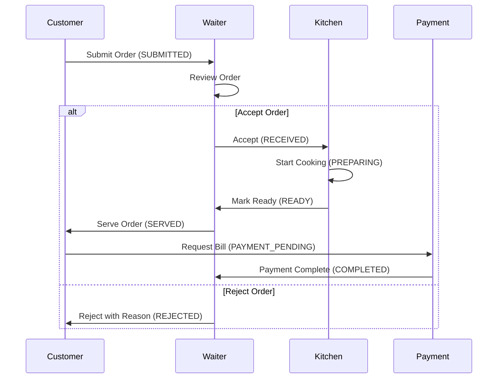

# Staff & Kitchen Display System (KDS) Guide

> **Last Updated**: January 19, 2026  
> **Audience**: Restaurant Staff (Waiters, Kitchen Staff, Managers)  
> **System**: Smart Restaurant QR Ordering Platform

## Table of Contents
- [Overview](#overview)
- [Staff Roles](#staff-roles)
- [Waiter Dashboard](#waiter-dashboard)
- [Kitchen Display System (KDS)](#kitchen-display-system-kds)
- [Order Management Workflow](#order-management-workflow)
- [Payment Processing](#payment-processing)
- [Troubleshooting](#troubleshooting)

---

## Overview

The Smart Restaurant system provides real-time order management through specialized dashboards for waiters and kitchen staff. All updates are synchronized instantly using WebSocket connections.

**System Features:**
- Real-time order notifications via Socket.IO
- Multi-status order tracking (SUBMITTED → RECEIVED → PREPARING → READY → SERVED → COMPLETED)
- Kitchen Display System (KDS) for cooking workflow
- Payment processing integration (Stripe, MoMo, VNPay, Cash)
- Table management and QR code ordering

---

## Staff Roles

### Role Permissions

| Role | Access Rights |
|------|---------------|
| **ADMIN** | Full restaurant management, reports, staff management, menu configuration |
| **WAITER** | Accept/reject orders, generate bills, view table status, serve orders |
| **KITCHEN** | View incoming orders, update cooking status, mark items ready |
| **CUSTOMER** | Browse menu, place orders, make payments, write reviews |
| **SUPER_ADMIN** | Manage all restaurants (system administrator) |

### Authentication
- Staff accounts are restaurant-specific (`restaurantId` assigned)
- Login via email/password or Google OAuth
- JWT token-based authentication (valid for 30 days)
- Password requirements: Minimum 8 characters

---

## Waiter Dashboard

### Login
1. Navigate to `/staff/login`
2. Enter email and password
3. Select "Waiter" role if prompted
4. Access granted to waiter dashboard

### Dashboard Overview

**Key Sections:**
- **Active Orders**: Orders awaiting acceptance (status: SUBMITTED)
- **In Progress**: Accepted orders being prepared (status: RECEIVED, PREPARING)
- **Ready to Serve**: Orders ready for delivery (status: READY)
- **Table Overview**: Table status (AVAILABLE, OCCUPIED, RESERVED, CLEANING)

### Order Management

#### 1. Accepting New Orders

**When a customer submits an order:**
1. Real-time notification appears (Socket.IO event: `new_order`)
2. Order displays in "Active Orders" section with:
   - Order number (e.g., ORD-0051)
   - Table number
   - Customer name/phone (if guest order)
   - Order items with modifiers
   - Total amount
   - Special instructions
3. **Actions:**
   - **Accept**: Click "Accept Order" → Status changes to RECEIVED → Sent to kitchen
   - **Reject**: Click "Reject" → Enter rejection reason → Status changes to REJECTED

**API Endpoint:**
```http
PUT /api/orders/:id/status
Authorization: Bearer <JWT_TOKEN>
Content-Type: application/json

{
  "status": "RECEIVED",
  "rejectionReason": "Out of ingredient X" // Only if rejecting
}
```

#### 2. Monitoring Order Progress

**Order Status Flow:**
```
SUBMITTED → RECEIVED → PREPARING → READY → SERVED → PAYMENT_PENDING → COMPLETED
     ↓
  REJECTED
```

**Real-time Updates:**
- Kitchen updates order status → Dashboard updates automatically
- Socket.IO event: `order_status_update`
- Visual indicators: Color-coded badges (Yellow=Preparing, Green=Ready, Blue=Served)

#### 3. Serving Orders

**When an order status is READY:**
1. Order appears in "Ready to Serve" section
2. Click "Mark as Served"
3. Status updates to SERVED
4. Customer can now request bill

**Timestamps Tracked:**
- `submittedAt`: Customer submission time
- `acceptedAt`: Waiter acceptance time
- `preparingAt`: Kitchen start time
- `readyAt`: Kitchen completion time
- `servedAt`: Waiter delivery time
- `completedAt`: Payment completion time

### Bill Generation

#### Creating a Bill

**Steps:**
1. Navigate to order details (status must be SERVED or later)
2. Click "Generate Bill"
3. System calculates:
   - **Subtotal**: Sum of all order items (quantity × unit price + modifiers)
   - **Tax**: Calculated based on restaurant settings (typically 8-10%)
   - **Discount**: Applied if any
   - **Total**: Subtotal + Tax - Discount
4. Bill number generated (e.g., BILL-1234)
5. Order status updates to PAYMENT_PENDING

**API Endpoint:**
```http
POST /api/orders/:id/bill
Authorization: Bearer <JWT_TOKEN>
Content-Type: application/json

{
  "createdBy": "<waiter_user_id>"
}
```

**Bill Details:**
```json
{
  "billNumber": "BILL-1234",
  "subtotal": 150000,
  "tax": 15000,
  "discount": 0,
  "total": 165000,
  "orderId": "<order_uuid>",
  "createdBy": "<waiter_uuid>",
  "createdAt": "2026-01-19T10:30:00Z"
}
```

### Table Management

#### Table Status

| Status | Meaning | Action |
|--------|---------|--------|
| AVAILABLE | Ready for customers | - |
| OCCUPIED | Active order in progress | Monitor order |
| RESERVED | Reserved for booking | - |
| CLEANING | Being cleaned | Mark available when done |

#### Updating Table Status

**Manual Update:**
```http
PUT /api/tables/:id
Authorization: Bearer <JWT_TOKEN>

{
  "status": "CLEANING"
}
```

**Automatic Updates:**
- Order placed → OCCUPIED
- Order completed + payment done → CLEANING (manual intervention)
- Cleaned → AVAILABLE

---

## Kitchen Display System (KDS)

### Login
1. Navigate to `/kitchen/login`
2. Enter kitchen staff credentials
3. Access granted to Kitchen Display dashboard

### KDS Dashboard Layout

**Screen Sections:**
1. **New Orders (RECEIVED)**: Newly accepted orders waiting to start
2. **In Progress (PREPARING)**: Orders currently being cooked
3. **Ready (READY)**: Completed orders ready for pickup

**Display Information per Order:**
- Order number
- Table number
- Item name, quantity, modifiers
- Special instructions
- Preparation time
- Elapsed time (visual timer)

### Order Preparation Workflow

#### 1. Starting an Order

**When order appears in "New Orders":**
1. Review order items and special instructions
2. Click "Start Cooking"
3. Order status updates to PREPARING
4. Timer starts tracking preparation time
5. Real-time update sent to waiter dashboard

**API Endpoint:**
```http
PUT /api/kitchen/orders/:id/status
Authorization: Bearer <JWT_TOKEN>

{
  "status": "PREPARING"
}
```

#### 2. Item-Level Status Tracking

**Each order item has independent status:**
- `queued`: Waiting to be cooked
- `cooking`: Currently being prepared
- `ready`: Item completed
- `rejected`: Cannot be prepared (e.g., out of stock)

**Update Individual Item:**
```http
PUT /api/kitchen/orders/:id/items/:itemId/status
Authorization: Bearer <JWT_TOKEN>

{
  "itemStatus": "cooking"
}
```

**Use Cases:**
- Multi-course meals: Mark appetizers ready before mains
- Different stations: Grill marks meat ready, fry station marks sides ready
- Out-of-stock: Reject individual items with reason

#### 3. Marking Order Ready

**When all items are prepared:**
1. Click "Mark Ready"
2. Order status updates to READY
3. Notification sent to waiter
4. Order moves to "Ready for Pickup" section
5. Visual alert (bell/sound notification)

**Socket.IO Event:**
```javascript
io.to(restaurantId).emit('order_status_update', {
  orderId: '<uuid>',
  status: 'READY',
  orderNumber: 'ORD-0051'
});
```

### Kitchen Statistics

**Real-time Metrics:**
- Orders in queue (RECEIVED)
- Orders cooking (PREPARING)
- Average preparation time
- Completed orders today
- Pending orders by table

**Accessing Stats:**
```http
GET /api/kitchen/stats?restaurantId=<uuid>
Authorization: Bearer <JWT_TOKEN>
```

---

## Order Management Workflow

### Complete Order Lifecycle



### Status Transitions

| From Status | To Status | Triggered By | Action |
|------------|-----------|--------------|---------|
| SUBMITTED | RECEIVED | Waiter accepts | Send to kitchen |
| SUBMITTED | REJECTED | Waiter rejects | Notify customer |
| RECEIVED | PREPARING | Kitchen starts | Begin cooking |
| PREPARING | READY | Kitchen completes | Notify waiter |
| READY | SERVED | Waiter delivers | Enable bill generation |
| SERVED | PAYMENT_PENDING | Waiter generates bill | Await payment |
| PAYMENT_PENDING | COMPLETED | Payment successful | Close order |
| * | CANCELLED | Admin/Waiter cancels | Refund if paid |

### Handling Special Cases

#### 1. Adding Items to Existing Order

**Scenario:** Customer requests additional items after initial order

**Steps:**
1. Locate existing order (status must be RECEIVED or later, but not COMPLETED)
2. Click "Add Items"
3. Select additional menu items
4. Items added to existing order
5. Kitchen notified of new items

**API Endpoint:**
```http
POST /api/orders/:id/items
Authorization: Bearer <JWT_TOKEN>

{
  "items": [
    {
      "menuItemId": "<uuid>",
      "quantity": 2,
      "modifiers": [],
      "specialInstructions": ""
    }
  ]
}
```

#### 2. Order Cancellation

**Before Kitchen Starts (RECEIVED):**
- Waiter can reject with reason
- No charges applied

**After Kitchen Starts (PREPARING):**
- Requires admin approval
- Partial charges may apply

**After Served (SERVED/PAYMENT_PENDING):**
- Full charges apply
- Requires refund process

#### 3. Order Modifications

**Customer Changes Mind:**
- If status is SUBMITTED: Reject and ask customer to reorder
- If status is RECEIVED: Contact kitchen immediately
- If status is PREPARING or later: Cannot modify

---

## Payment Processing

### Payment Methods Supported

| Method | Gateway | Customer Flow |
|--------|---------|---------------|
| **Stripe** | Stripe API | Card payment via Stripe Elements |
| **MoMo** | MoMo Payment Gateway | Mobile wallet payment |
| **VNPay** | VNPay Gateway | Vietnamese bank cards |
| **ZaloPay** | ZaloPay API | ZaloPay wallet |
| **Cash** | Manual | Pay at counter |
| **Card at Counter** | Manual | Pay at counter with card |

### Payment Workflow

#### 1. Customer Initiates Payment

**After order is SERVED:**
1. Customer clicks "Request Bill" or scans QR code
2. Bill generated (PAYMENT_PENDING status)
3. Customer selects payment method
4. Payment gateway processes transaction

#### 2. Payment Confirmation

**Real-time Updates:**
- Payment successful → Socket.IO event: `payment_received`
- Order status → COMPLETED
- Waiter dashboard updated automatically

**Payment Record Created:**
```json
{
  "paymentId": "<uuid>",
  "amount": 150000,
  "tax": 15000,
  "tip": 0,
  "total": 165000,
  "method": "STRIPE",
  "status": "COMPLETED",
  "gatewayTransactionId": "pi_xyz123",
  "orderId": "<order_uuid>",
  "paidAt": "2026-01-19T11:00:00Z"
}
```

#### 3. Payment Failure

**If payment fails:**
1. Payment status: FAILED
2. Customer notified to retry
3. Order remains PAYMENT_PENDING
4. Waiter can offer alternative payment method

**Retry Flow:**
```http
POST /api/payments
Authorization: Bearer <JWT_TOKEN>

{
  "orderId": "<uuid>",
  "amount": 165000,
  "method": "CASH",
  "restaurantId": "<uuid>"
}
```

### Manual Payment Processing (Cash/Card at Counter)

**Steps:**
1. Customer brings bill to counter
2. Waiter receives payment
3. Waiter marks payment as completed in system:

```http
POST /api/payments
Authorization: Bearer <JWT_TOKEN>

{
  "orderId": "<uuid>",
  "amount": 165000,
  "tax": 15000,
  "tip": 5000,
  "total": 170000,
  "method": "CASH",
  "status": "COMPLETED",
  "restaurantId": "<uuid>"
}
```

4. System updates order status to COMPLETED
5. Receipt printed (optional)

### Tips Handling

**Tip Entry:**
- Customer can add tip during digital payment
- Waiter can add tip for cash payments
- Tips recorded in payment record
- Tips tracked for reporting

---

## Troubleshooting

### Common Issues

#### 1. Orders Not Appearing in Dashboard

**Problem:** New orders not showing in waiter dashboard

**Solutions:**
- Check internet connection
- Verify Socket.IO connection (look for green indicator)
- Refresh browser page (press F5)
- Clear browser cache and reload
- Check if logged into correct restaurant

**Technical Check:**
```javascript
// Browser console
localStorage.getItem('token') // Should return JWT token
// Check socket connection
socket.connected // Should be true
```

#### 2. Cannot Accept Order

**Problem:** "Accept Order" button disabled or returns error

**Possible Causes:**
- Order already accepted by another waiter
- Order was cancelled by customer
- Network connectivity issue
- Authorization token expired

**Solutions:**
- Refresh page and check order status
- Re-login if token expired (session > 30 days)
- Contact admin if issue persists

#### 3. Kitchen Not Receiving Orders

**Problem:** Accepted orders not appearing in KDS

**Solutions:**
- Check kitchen staff login (must be KITCHEN role)
- Verify restaurantId matches
- Check Socket.IO connection in kitchen dashboard
- Ensure order status is RECEIVED or later
- Network firewall may be blocking WebSocket connections (port needs to be open)

#### 4. Bill Generation Fails

**Problem:** Cannot generate bill for order

**Requirements:**
- Order must be in SERVED status or later
- Order cannot already have a bill (1-to-1 relationship)
- Waiter must have permission

**Check:**
```http
GET /api/orders/:id
Authorization: Bearer <JWT_TOKEN>

// Response should show:
{
  "status": "SERVED",
  "bill": null // No bill exists yet
}
```

#### 5. Payment Not Completing

**Problem:** Payment processing fails or hangs

**Common Causes:**
- Payment gateway timeout
- Insufficient funds
- Invalid card details
- Network interruption

**Recovery Steps:**
1. Check payment status in admin panel
2. Verify with payment gateway (Stripe dashboard, MoMo portal)
3. Retry payment with same or different method
4. If payment succeeded on gateway but not reflected: Contact admin to reconcile

**Manual Reconciliation:**
```http
POST /api/payments/webhook
Content-Type: application/json

{
  "type": "payment_intent.succeeded",
  "data": {
    "object": {
      "id": "pi_xyz123",
      "metadata": {
        "orderId": "<uuid>"
      }
    }
  }
}
```

### Network Connectivity

**WebSocket Connection Issues:**

**Symptoms:**
- No real-time updates
- Orders not appearing automatically
- Status changes not reflected

**Diagnosis:**
```javascript
// Browser console
io.connected // false = disconnected
```

**Solutions:**
1. Check firewall settings (allow WebSocket connections)
2. Verify backend server is running
3. Check CORS configuration (frontend domain must be whitelisted)
4. Try alternative network (4G/5G if WiFi fails)

### Performance Optimization

**For Busy Restaurants:**

**Best Practices:**
1. Close old completed orders (archive orders older than 7 days)
2. Limit dashboard to show only active orders (last 24 hours)
3. Use filters to focus on specific tables/statuses
4. Clear browser cache weekly
5. Use modern browsers (Chrome, Firefox, Edge latest versions)

**Browser Requirements:**
- JavaScript enabled
- Cookies and LocalStorage enabled
- WebSocket support (all modern browsers)
- Minimum 2GB RAM recommended

---

## Real-Time Events Reference

### Socket.IO Events

**Events Emitted by Server:**

| Event | Description | Payload |
|-------|-------------|---------|
| `new_order` | New order submitted | `{ order: {...} }` |
| `order_status_update` | Order status changed | `{ orderId, status, orderNumber }` |
| `payment_received` | Payment completed | `{ orderId, paymentId }` |
| `payment_confirmed` | Payment confirmed | `{ orderId }` |
| `order_items_added` | Items added to order | `{ orderId, newItems }` |

**Events Listened by Server:**

| Event | Description | Payload |
|-------|-------------|---------|
| `join_restaurant` | Client joins restaurant room | `restaurantId` |
| `disconnect` | Client disconnects | - |

**Client-Side Implementation Example:**
```javascript
// Waiter dashboard
socket.on('new_order', (order) => {
  // Play notification sound
  playNotificationSound();
  
  // Add to orders list
  addOrderToList(order);
  
  // Show toast notification
  showToast(`New order ${order.orderNumber} from Table ${order.table.tableNumber}`);
});

socket.on('order_status_update', (data) => {
  // Update order status in UI
  updateOrderStatus(data.orderId, data.status);
});
```

---

## Keyboard Shortcuts (Coming Soon)

**Planned Shortcuts:**
- `N` - View new orders
- `P` - View in-progress orders
- `R` - View ready orders
- `B` - Generate bill (when order selected)
- `A` - Accept order (when order selected)
- `Esc` - Close modal/dialog

---

## Mobile App Access

**Responsive Design:**
- Dashboard optimized for tablets (10" recommended)
- Kitchen Display works on large tablets (12"+)
- Mobile phones supported but tablet recommended for best experience

**Native Apps (Future):**
- iOS app (planned)
- Android app (planned)
- Offline mode support (planned)

---

## Support & Training

**Training Resources:**
- Video tutorials: [Link to training videos]
- PDF quick reference guide: [Download link]
- Live training sessions: Contact admin

**Support Channels:**
- In-app help button (chat support)
- Email: support@smartrestaurant.com
- Phone: [Support hotline]
- Admin dashboard: Submit ticket

**Reporting Bugs:**
1. Take screenshot of issue
2. Note order number and timestamp
3. Describe what you were trying to do
4. Submit via admin panel → Support → Report Issue

---

## Appendix

### API Endpoints Quick Reference

| Action | Method | Endpoint | Role Required |
|--------|--------|----------|---------------|
| Get orders | GET | `/api/orders?restaurantId=<id>` | WAITER, ADMIN |
| Accept order | PUT | `/api/orders/:id/status` | WAITER, ADMIN |
| Generate bill | POST | `/api/orders/:id/bill` | WAITER, ADMIN |
| Process payment | POST | `/api/payments` | ANY |
| Get kitchen orders | GET | `/api/kitchen/orders?restaurantId=<id>` | KITCHEN |
| Update order status | PUT | `/api/kitchen/orders/:id/status` | KITCHEN |
| Update item status | PUT | `/api/kitchen/orders/:id/items/:itemId/status` | KITCHEN |

### System Requirements

**Hardware:**
- Processor: Intel i3 or equivalent (minimum)
- RAM: 4GB (minimum), 8GB (recommended)
- Display: 1920×1080 resolution (minimum)
- Network: Stable internet connection (5 Mbps minimum)

**Software:**
- OS: Windows 10+, macOS 10.14+, Linux (Ubuntu 20.04+)
- Browser: Chrome 90+, Firefox 88+, Edge 90+, Safari 14+
- Node.js: v18+ (backend server)
