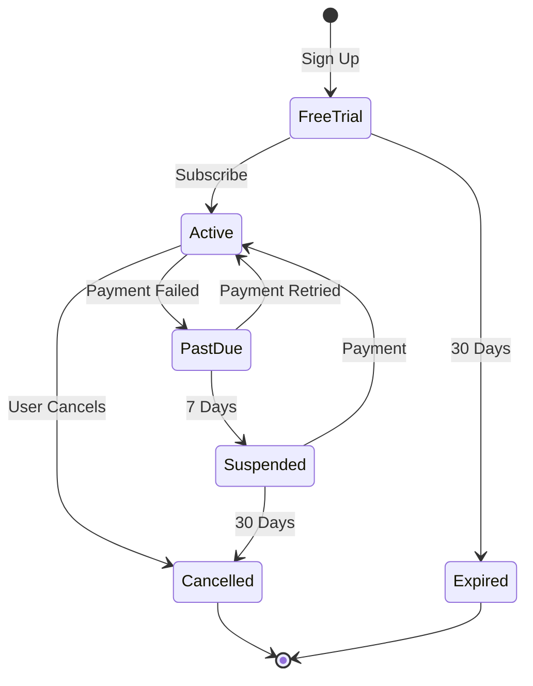
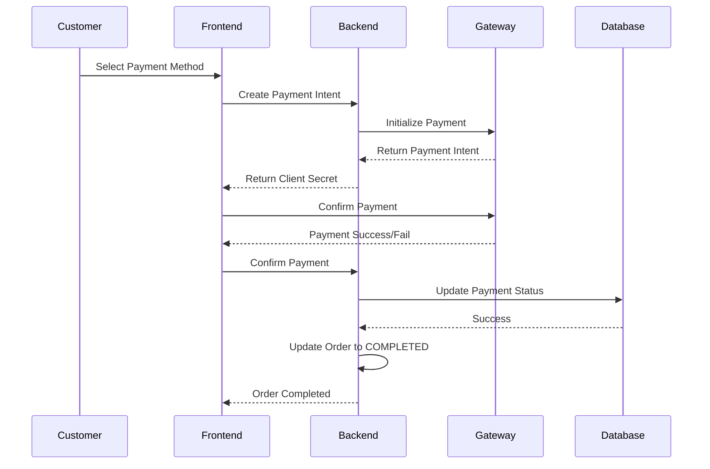

# Billing, Pricing & Transaction Reports

> **Last Updated**: January 19, 2026  
> **Purpose**: Define billing model, pricing strategy, and financial reporting  
> **Scope**: B2B (Restaurant subscriptions) and B2C (Customer transactions)

## Table of Contents
- [Overview](#overview)
- [Billing Model](#billing-model)
- [Pricing Strategy](#pricing-strategy)
- [Transaction Processing](#transaction-processing)
- [Financial Reports](#financial-reports)
- [Payment Gateway Integration](#payment-gateway-integration)
- [Tax & Compliance](#tax--compliance)

---

## Overview

The Smart Restaurant system operates on a dual revenue model:
1. **B2B**: SaaS subscription fees from restaurant owners
2. **B2C**: Transaction processing fees from customer payments

**Current Status:** B2C transaction processing fully implemented. B2B subscription billing planned for Phase 2.

---

## Billing Model

### B2B: Restaurant Subscriptions (Planned)

#### Subscription Tiers

| Tier | Price (VND/month) | Price (USD/month) | Features |
|------|-------------------|-------------------|----------|
| **Free Trial** | 0 | 0 | 30 days, 1 restaurant, up to 5 tables, 50 orders/month |
| **Starter** | 500,000 | 20 | 1 restaurant, up to 10 tables, 500 orders/month |
| **Professional** | 1,500,000 | 60 | 1 restaurant, up to 30 tables, unlimited orders, analytics |
| **Enterprise** | 3,000,000 | 120 | Up to 5 restaurants, unlimited tables/orders, priority support, custom branding |

**Additional Charges:**
- Extra restaurant: +1,000,000 VND/month
- Custom domain: +200,000 VND/month
- Dedicated support: +500,000 VND/month

#### Billing Cycle

**Options:**
- Monthly billing (billed on 1st of each month)
- Annual billing (15% discount)
- Pay-as-you-go (not available for Free Trial)

**Payment Methods:**
- Credit/Debit card (via Stripe)
- Bank transfer (Vietnamese banks)
- Invoice (for Enterprise tier, NET 30)

#### Subscription Lifecycle



**Grace Period:**
- Payment failure: 7-day grace period
- Suspension: Restaurant dashboard read-only, orders disabled
- Cancellation: Data retained for 90 days, then deleted

---

### B2C: Transaction Fees (Current)

#### Fee Structure

**Payment Gateway Fees:**

| Gateway | Transaction Fee | Currency | Minimum Fee |
|---------|----------------|----------|-------------|
| **Stripe** | 3.4% + 5,000 VND | VND | 5,000 VND |
| **MoMo** | 2.5% | VND | - |
| **VNPay** | 2.0% + 2,000 VND | VND | 2,000 VND |
| **ZaloPay** | 2.5% | VND | - |
| **Cash/Card at Counter** | 0% | - | - |

**Platform Fee (Optional):**
- Smart Restaurant commission: 2% of transaction value (if enabled)

**Example Calculation:**

Customer pays 550,000 VND for order via Stripe:
- Stripe fee: (550,000 × 3.4%) + 5,000 = 18,700 + 5,000 = 23,700 VND
- Platform fee (if enabled): 550,000 × 2% = 11,000 VND
- Restaurant receives: 550,000 - 23,700 - 11,000 = 515,300 VND

---

## Pricing Strategy

### Dynamic Pricing (Future)

**Planned Features:**
- Peak hour pricing (10-20% markup during rush hours)
- Happy hour discounts (20-30% off during slow periods)
- Loyalty program discounts (5-15% for repeat customers)
- Group discounts (10% off for orders > 5 items)

### Menu Item Pricing

**Current Strategy:**
- Fixed pricing per item
- Modifier adjustments (addons/upgrades)
- No surge pricing or dynamic adjustments

**Pricing Configuration:**
```javascript
// MenuItem schema
{
  price: Decimal(10, 2), // Base price
  modifierGroups: [
    {
      name: "Size",
      options: [
        { name: "Small", priceAdjustment: 0 },
        { name: "Medium", priceAdjustment: 20000 },
        { name: "Large", priceAdjustment: 40000 }
      ]
    }
  ]
}
```

### Discount Management

**Discount Types:**

| Type | Implementation | Status |
|------|----------------|--------|
| **Percentage Discount** | `discount = subtotal * percentage` | ✅ Implemented |
| **Fixed Amount** | `discount = fixed_value` | ✅ Implemented |
| **Promo Code** | Database of codes | 📋 Planned |
| **Loyalty Points** | Points-based rewards | 📋 Planned |
| **First Order** | 10-15% off | 📋 Planned |

**Application:**
```javascript
// Order discount field
{
  orderId: "uuid",
  discount: 50000, // VND
  // Final bill calculation
  subtotal: 500000,
  tax: 50000,
  discount: 50000,
  total: 500000 + 50000 - 50000 = 500000
}
```

---

## Transaction Processing

### Payment Flow



### Payment Record Structure

```javascript
// Payment schema
{
  id: "uuid",
  amount: Decimal(10, 2), // Base amount
  tax: Decimal(10, 2), // Tax amount
  tip: Decimal(10, 2), // Customer tip
  total: Decimal(10, 2), // amount + tax + tip
  method: "STRIPE|MOMO|VNPAY|ZALOPAY|CASH|CARD_AT_COUNTER",
  status: "PENDING|PROCESSING|COMPLETED|FAILED|REFUNDED",
  gatewayTransactionId: "string", // External transaction ID
  gatewayResponse: {}, // Full gateway response
  orderId: "uuid",
  restaurantId: "uuid",
  paidAt: "timestamp",
  createdAt: "timestamp",
  updatedAt: "timestamp"
}
```

### Payment Status Lifecycle

| Status | Description | Next Actions |
|--------|-------------|--------------|
| **PENDING** | Payment initiated, awaiting confirmation | → PROCESSING or FAILED |
| **PROCESSING** | Gateway processing payment | → COMPLETED or FAILED |
| **COMPLETED** | Payment successful | Order marked COMPLETED |
| **FAILED** | Payment failed | Retry or cancel order |
| **REFUNDED** | Payment refunded | Create refund record |

### Refund Processing

**Refund Policy:**
- Full refund: Within 24 hours of payment
- Partial refund: For item cancellations
- No refund: After food served

**Refund Implementation:**
```javascript
// Create refund record
{
  paymentId: "original_payment_uuid",
  refundAmount: Decimal(10, 2),
  refundReason: "customer_request|error|duplicate",
  gatewayRefundId: "string",
  status: "PENDING|COMPLETED|FAILED",
  createdAt: "timestamp"
}
```

**API Endpoint:**
```http
POST /api/payments/:id/refund
Authorization: Bearer <ADMIN_TOKEN>

{
  "amount": 550000,
  "reason": "Customer cancelled order"
}
```

---

## Financial Reports

### Daily Sales Report

**Data Points:**
- Total revenue (by payment method)
- Number of transactions
- Average transaction value
- Total tips received
- Total tax collected
- Failed transactions

**API Endpoint:**
```http
GET /api/reports/revenue?restaurantId=<uuid>&startDate=2026-01-19&endDate=2026-01-19
Authorization: Bearer <JWT_TOKEN>
```

**Response:**
```javascript
{
  "success": true,
  "data": {
    "restaurantId": "uuid",
    "startDate": "2026-01-19T00:00:00Z",
    "endDate": "2026-01-19T23:59:59Z",
    "totalRevenue": 5500000,
    "totalOrders": 42,
    "totalItems": 128,
    "averageOrderValue": 130952,
    "chartData": [
      { "date": "2026-01-19", "revenue": 5500000 }
    ]
  }
}
```

### Revenue by Menu Item

**Top Revenue Items:**
```http
GET /api/reports/top-items?restaurantId=<uuid>&limit=10&startDate=2026-01-01&endDate=2026-01-31
Authorization: Bearer <JWT_TOKEN>
```

**Response:**
```javascript
{
  "success": true,
  "data": [
    {
      "menuItemId": "uuid",
      "name": "Grilled Salmon",
      "totalRevenue": 2500000,
      "totalQuantity": 50,
      "averagePrice": 50000,
      "orderCount": 42
    },
    // ... more items
  ]
}
```

### Revenue Chart Data

**Time-series Revenue:**
```http
GET /api/reports/chart?restaurantId=<uuid>&period=daily&startDate=2026-01-01&endDate=2026-01-31
Authorization: Bearer <JWT_TOKEN>
```

**Periods:**
- `hourly`: Revenue by hour (for today)
- `daily`: Revenue by day (default)
- `weekly`: Revenue by week
- `monthly`: Revenue by month

**Response:**
```javascript
{
  "success": true,
  "data": {
    "period": "daily",
    "chartData": [
      {
        "date": "2026-01-01",
        "revenue": 450000,
        "orderCount": 35,
        "averageOrderValue": 128571
      },
      // ... more data points
    ]
  }
}
```

### PDF Report Generation (Implemented)

**Export Sales Report:**
```http
GET /api/reports/export/pdf?restaurantId=<uuid>&startDate=2026-01-01&endDate=2026-01-31
Authorization: Bearer <JWT_TOKEN>
```

**Report Contents:**
- Restaurant information
- Date range
- Overview metrics (total revenue, orders, AOV)
- Top 10 menu items by revenue
- Revenue chart (if feasible in PDF)

**Implementation:**
```javascript
// backend/src/services/report.service.js
async generatePDFReport(restaurantId, startDate, endDate) {
  const PDFDocument = require('pdfkit');
  const doc = new PDFDocument();
  
  // Fetch data
  const revenueData = await this.getRevenueReport(restaurantId, startDate, endDate);
  const topItems = await this.getTopRevenueByMenuItem(restaurantId, 10, startDate, endDate);
  
  // Generate PDF
  doc.fontSize(20).text('Sales Report', { align: 'center' });
  doc.fontSize(12).text(`Date Range: ${startDate} to ${endDate}`);
  // ... add metrics and charts
  
  return doc;
}
```

### Transaction Log

**All Transactions:**
```sql
SELECT
  p.id,
  p.orderId,
  o.orderNumber,
  p.amount,
  p.tax,
  p.tip,
  p.total,
  p.method,
  p.status,
  p.gatewayTransactionId,
  p.paidAt,
  r.name as restaurantName
FROM payments p
JOIN orders o ON p.orderId = o.id
JOIN restaurants r ON p.restaurantId = r.id
WHERE p.restaurantId = '${restaurantId}'
  AND p.createdAt >= '${startDate}'
  AND p.createdAt <= '${endDate}'
ORDER BY p.paidAt DESC;
```

**Export to CSV:**
```http
GET /api/reports/export/csv?restaurantId=<uuid>&type=transactions&startDate=2026-01-01&endDate=2026-01-31
Authorization: Bearer <JWT_TOKEN>
```

---

## Payment Gateway Integration

### Stripe (Implemented)

**Configuration:**
```javascript
// .env
STRIPE_SECRET_KEY=sk_test_...
STRIPE_PUBLISHABLE_KEY=pk_test_...
STRIPE_WEBHOOK_SECRET=whsec_...
```

**Create Payment Intent:**
```javascript
// backend/src/services/payment.service.js
async createStripePaymentIntent({ orderId, amount, currency = 'vnd' }) {
  const stripe = require('stripe')(process.env.STRIPE_SECRET_KEY);
  
  const paymentIntent = await stripe.paymentIntents.create({
    amount: Math.round(amount), // Stripe expects smallest currency unit
    currency,
    metadata: { orderId },
    automatic_payment_methods: { enabled: true }
  });
  
  return {
    clientSecret: paymentIntent.client_secret,
    paymentIntentId: paymentIntent.id
  };
}
```

**Webhook Handling:**
```javascript
// backend/src/controllers/payment.controller.js
exports.webhook = async (req, res) => {
  const sig = req.headers['stripe-signature'];
  const event = stripe.webhooks.constructEvent(
    req.body,
    sig,
    process.env.STRIPE_WEBHOOK_SECRET
  );
  
  if (event.type === 'payment_intent.succeeded') {
    const paymentIntent = event.data.object;
    await paymentService.confirmStripePayment(paymentIntent.id);
  }
  
  res.json({ received: true });
};
```

### MoMo (Implemented)

**Configuration:**
```javascript
// .env
MOMO_PARTNER_CODE=MOMO...
MOMO_ACCESS_KEY=...
MOMO_SECRET_KEY=...
MOMO_ENDPOINT=https://test-payment.momo.vn/v2/gateway/api/create
```

**Create Payment:**
```javascript
async createMomoPayment({ orderId, amount }) {
  const crypto = require('crypto');
  
  const rawSignature = `accessKey=${accessKey}&amount=${amount}&extraData=${extraData}&ipnUrl=${ipnUrl}&orderId=${orderId}&orderInfo=${orderInfo}&partnerCode=${partnerCode}&redirectUrl=${redirectUrl}&requestId=${requestId}&requestType=${requestType}`;
  
  const signature = crypto
    .createHmac('sha256', secretKey)
    .update(rawSignature)
    .digest('hex');
  
  const response = await axios.post(MOMO_ENDPOINT, {
    partnerCode,
    accessKey,
    requestId,
    amount,
    orderId,
    orderInfo,
    redirectUrl,
    ipnUrl,
    signature,
    // ... other params
  });
  
  return {
    payUrl: response.data.payUrl,
    qrCodeUrl: response.data.qrCodeUrl
  };
}
```

**IPN (Instant Payment Notification) Callback:**
```javascript
exports.momoCallback = async (req, res) => {
  const { orderId, resultCode, message } = req.body;
  
  if (resultCode === 0) {
    // Payment successful
    await paymentService.updatePaymentStatus(orderId, 'COMPLETED');
  } else {
    // Payment failed
    await paymentService.updatePaymentStatus(orderId, 'FAILED');
  }
  
  res.json({ success: true });
};
```

### VNPay & ZaloPay (Similar Implementation)

**Configuration:** Similar to MoMo with respective API credentials

**Integration Pattern:**
1. Create payment request with HMAC signature
2. Redirect customer to payment gateway
3. Gateway processes payment
4. IPN callback updates payment status
5. Customer redirected back to app

---

## Tax & Compliance

### Tax Calculation

**Current Implementation:**
```javascript
// Bill calculation
const subtotal = orderItems.reduce((sum, item) => {
  return sum + (item.quantity * item.unitPrice);
}, 0);

const taxRate = 0.10; // 10% VAT
const tax = subtotal * taxRate;
const discount = order.discount || 0;
const total = subtotal + tax - discount;

// Create bill
await prisma.bill.create({
  data: {
    billNumber: generateBillNumber(),
    subtotal,
    tax,
    discount,
    total,
    orderId,
    restaurantId,
    createdBy: req.user.id
  }
});
```

**Tax Configuration (Future):**
- Configurable tax rates per restaurant
- Multiple tax types (VAT, service charge, local tax)
- Tax exemptions for certain items

### Invoicing

**Invoice Generation:**
- Bill serves as invoice
- Required fields: Bill number, date, restaurant info, itemized list, tax breakdown, total
- PDF export available

**Invoice Numbering:**
```javascript
function generateBillNumber() {
  // Format: BILL-YYYYMMDD-XXXX
  const date = new Date();
  const dateStr = date.toISOString().split('T')[0].replace(/-/g, '');
  const sequence = getNextSequence(date); // Auto-increment per day
  return `BILL-${dateStr}-${sequence.toString().padStart(4, '0')}`;
}
// Example: BILL-20260119-0042
```

### Compliance

**Data Retention:**
- Transaction records: 7 years (legal requirement)
- Customer data: Until account deletion + 90 days
- Payment gateway logs: 12 months

**PCI DSS Compliance:**
- No card data stored on our servers
- All card processing via PCI-compliant gateways (Stripe, MoMo, VNPay)
- HTTPS/TLS encryption for all communication

**GDPR/Data Privacy:**
- Customer data anonymization on request
- Right to data export (JSON format)
- Right to erasure (90-day deletion process)

---

## Reconciliation

### Daily Reconciliation

**Process:**
1. Export payment records from database
2. Export transaction reports from payment gateways
3. Match transactions by `gatewayTransactionId`
4. Flag discrepancies for manual review

**Automated Reconciliation Script:**
```javascript
async function reconcilePayments(restaurantId, date) {
  // Get payments from database
  const dbPayments = await prisma.payment.findMany({
    where: {
      restaurantId,
      paidAt: {
        gte: new Date(date + 'T00:00:00Z'),
        lte: new Date(date + 'T23:59:59Z')
      },
      status: 'COMPLETED'
    }
  });
  
  // Get transactions from Stripe
  const stripePayments = await stripe.charges.list({
    created: {
      gte: Math.floor(new Date(date).getTime() / 1000),
      lte: Math.floor(new Date(date).getTime() / 1000) + 86400
    }
  });
  
  // Match and flag discrepancies
  const discrepancies = findDiscrepancies(dbPayments, stripePayments);
  
  return discrepancies;
}
```

### Settlement Reports

**Bank Settlement:**
- Stripe: T+2 days (2 business days after transaction)
- MoMo: T+1 to T+3 days
- VNPay: T+1 to T+7 days

**Track Settlement:**
```javascript
{
  paymentId: "uuid",
  gatewayTransactionId: "pi_xyz123",
  amount: 550000,
  gatewayFee: 23700,
  platformFee: 11000,
  netAmount: 515300,
  settlementDate: "2026-01-21", // Expected
  actualSettlementDate: null, // Updated when funds received
  status: "PENDING|SETTLED"
}
```

---

## Appendix

### Currency Formatting

**VND Formatting:**
```javascript
function formatVND(amount) {
  return new Intl.NumberFormat('vi-VN', {
    style: 'currency',
    currency: 'VND'
  }).format(amount);
}
// Example: formatVND(550000) → "550.000 ₫"
```

**Multi-currency Support (Future):**
```javascript
function formatCurrency(amount, currency = 'VND') {
  return new Intl.NumberFormat('vi-VN', {
    style: 'currency',
    currency
  }).format(amount);
}
```

### Financial Terms Glossary

| Term | Definition |
|------|------------|
| **AOV (Average Order Value)** | Total Revenue / Number of Orders |
| **GMV (Gross Merchandise Value)** | Total value of all transactions |
| **Take Rate** | Platform fee as % of GMV |
| **Chargeback** | Disputed transaction reversed by bank |
| **Settlement** | Transfer of funds from gateway to merchant |
| **Reconciliation** | Matching database records with gateway reports |

