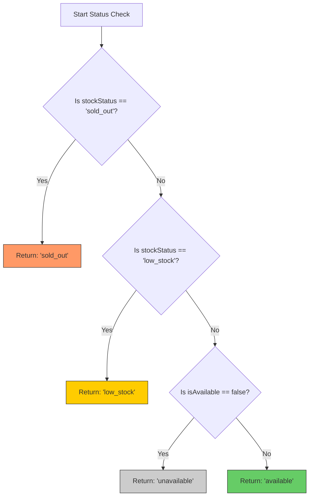

# Menu Item Status Documentation

> **Role**: Business / System Logic  
> **Version**: 1.1  
> **Last Updated**: 2026-01-19

---

## 📚 Table of Contents
1. [Overview](#1-overview)
2. [Data Model](#2-data-model)
3. [Status Computation Logic](#3-status-computation-logic)
4. [Frontend Status Values](#4-frontend-status-values)
5. [API Interactions](#5-api-interactions)
   - [Fetching Items with Filters](#fetching-items-with-filters)
   - [Calculating Derived Status](#calculating-derived-status)
6. [Examples](#6-examples)
7. [Visual Representation](#7-visual-representation)

---

## 1. Overview
This document defines how the availability status of a Menu Item is determined, stored, and presented in the Smart Restaurant system.

A Menu Item's visibility and "orderability" depend on two distinct controls:
1.  **Administrative Control**: Whether the manager explicitly wants to show/hide the item (e.g., Seasonal dish).
2.  **Inventory Control**: Whether the kitchen physically has the ingredients.

---

## 2. Data Model

The `MenuItem` table in the database utilizes two separate fields for this logic. These are stored in the backend (Prisma Schema).

| Field Name | Type | Default | Description |
| :--- | :--- | :--- | :--- |
| `isAvailable` | `Boolean` | `true` | **Master Switch**. Controlled by Admin. If `false`, item is effectively hidden or disabled regardless of stock. |
| `stockStatus` | `String` | `"available"` | **Inventory Level**. Controlled by Kitchen/Admin. <br>Enum-like values: `["available", "low_stock", "sold_out"]`. |

> **Note**: There is no single "Status" column in the database. The single "Status" field seen by the frontend is **computed** on the fly.

---

## 3. Status Computation Logic

When the Frontend requests menu items (`GET /api/menu/:restaurantId/items`), the Backend Service (`MenuService`) calculates a derived `status` field for every item based on the following precedence rules:

**Priority 1: Inventory Check**
If the item is physically out of stock, it cannot be ordered, even if the admin marked it as "Available".

**Priority 2: Admin Override**
If the admin explicitly turns off `isAvailable`, the item is unavailable, regardless of stock levels.

**Pseudocode Logic:**
```javascript
// Located in backend/src/services/menu.service.js

if (item.stockStatus === 'sold_out') {
    return 'sold_out';       // 🛑 Priority: Highest (Out Of Stock)
} 
else if (item.stockStatus === 'low_stock') {
    return 'low_stock';      // ⚠️ Priority: Warning level
} 
else if (item.isAvailable === false) {
    return 'unavailable';    // 🚫 Priority: Manual Disable
} 
else {
    return 'available';      // ✅ Priority: Normal
}
```

---

## 4. Frontend Status Values

The API returns a JSON field `status` with one of four values. The Frontend UI reacts to these values as follows:

| Computed Status | Orderable? | Display Color | UI Behavior |
| :--- | :---: | :--- | :--- |
| `available` | ✅ Yes | **Green** / Default | Item shows normally. "Add to Cart" button active. |
| `low_stock` | ✅ Yes | **Yellow** / Amber | Item shows with specific badge (e.g., "Only 5 left!"). "Add to Cart" active. |
| `sold_out` | ❌ No | **Orange** / Red | Item grayed out or shows "Sold Out" overlay. Button disabled. |
| `unavailable` | ❌ No | **Gray** / Hidden | Item typically hidden from guest menu, or shown as "Currently Unavailable" with disabled interaction. |

---

## 5. API Interactions

### Filtering Items by Status
The API supports filtering by this computed status logic directly via query parameters.

**Endpoint:** `GET /api/menu/:restaurantId/items`

| Query Param (`status`) | Backend Filter Logic | Use Case |
| :--- | :--- | :--- |
| `?status=available` | `isAvailable = true` AND `stockStatus != 'sold_out'` AND `stockStatus != 'low_stock'` | Guest Menu (Show only purely available items) |
| `?status=low_stock` | `stockStatus = 'low_stock'` | Dashboard (Alert kitchen to restock) |
| `?status=sold_out` | `stockStatus = 'sold_out'` | Dashboard (Items needing immediate attention) |
| `?status=unavailable` | `isAvailable = false` | Admin Panel (View hidden items) |

### JSON Response Body (Example)
```json
{
  "id": "uuid-1234",
  "name": "Grilled Salmon",
  "price": 25.00,
  "isAvailable": true,
  "stockStatus": "low_stock",
  "status": "low_stock"  // <--- Computed Field
}
```

---

## 6. Examples

### Scenario A: Normal Operations
*   **DB**: `{ isAvailable: true, stockStatus: "available" }`
*   **Result**: `available`
*   **UX**: Customer sees item, clicks add.

### Scenario B: Running Low
*   **DB**: `{ isAvailable: true, stockStatus: "low_stock" }`
*   **Result**: `low_stock`
*   **UX**: Customer sees "Limited Quantity" badge.

### Scenario C: Admin removes seasonal item
*   **DB**: `{ isAvailable: false, stockStatus: "available" }`
*   **Result**: `unavailable`
*   **UX**: Item hidden or disabled on menu.

### Scenario D: Daily Special sells out
*   **DB**: `{ isAvailable: true, stockStatus: "sold_out" }`
*   **Result**: `sold_out`
*   **UX**: Item visible but "Sold Out" badges overlay button.

### Scenario E: Admin hides Sold Out item
*   **DB**: `{ isAvailable: false, stockStatus: "sold_out" }`
*   **Result**: `sold_out` (Stock status takes logical precedence in typical backend sorting, OR `unavailable` depending on implementation nuance. *Current Service implementation checks sold_out first*).

---

## 7. Visual Representation


