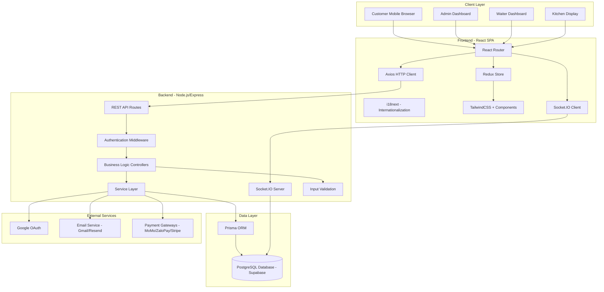
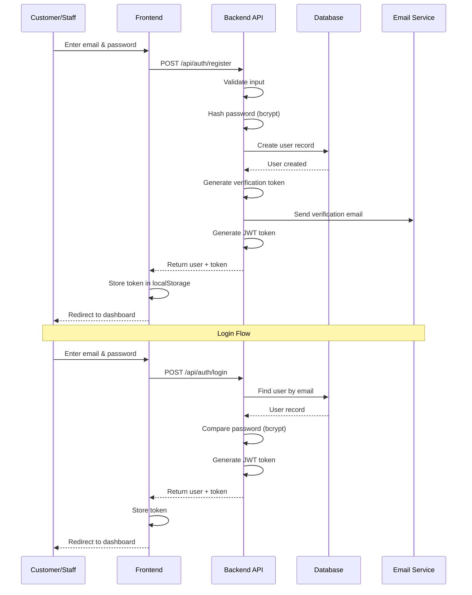
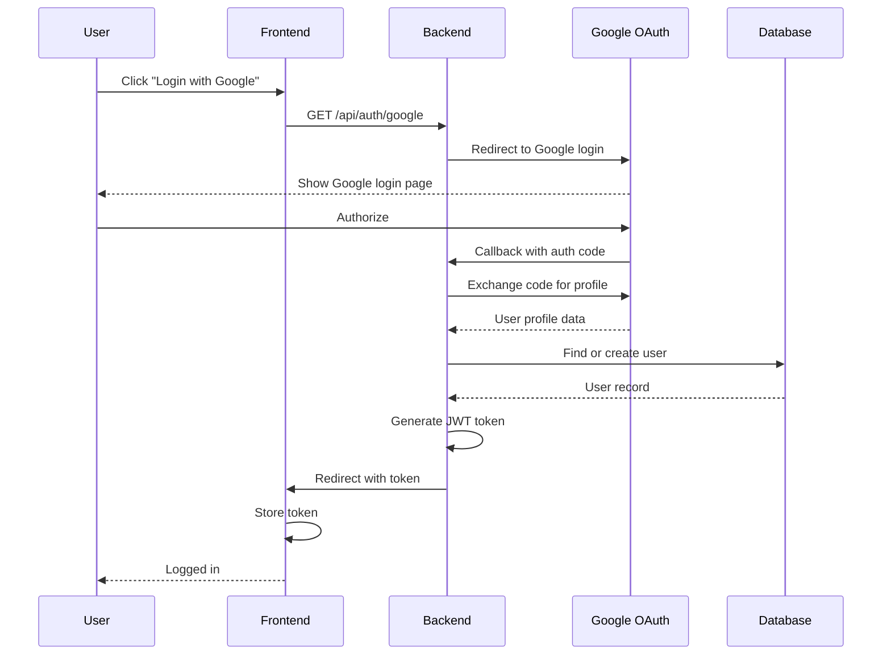
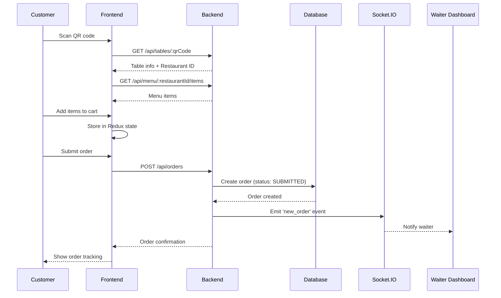
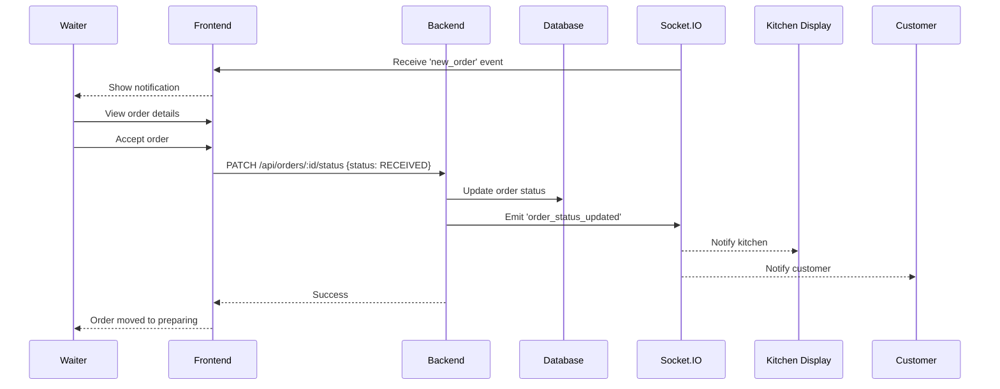
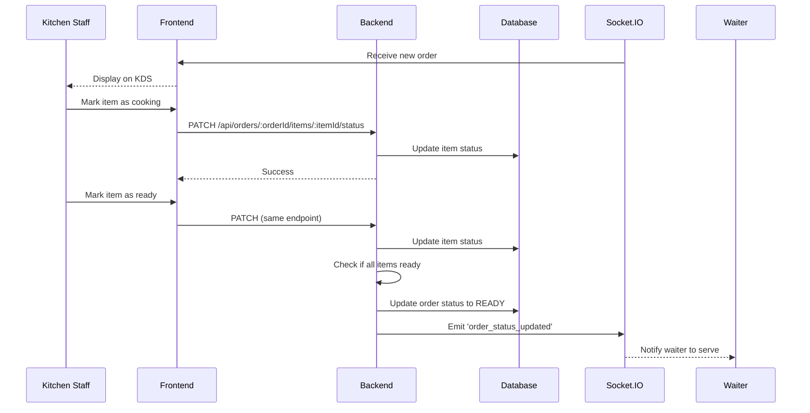

# System Architecture - Smart Restaurant QR Ordering System

## Table of Contents
- [Overview](#overview)
- [High-Level Architecture](#high-level-architecture)
- [Technology Stack](#technology-stack)
- [Frontend Architecture](#frontend-architecture)
- [Backend Architecture](#backend-architecture)
- [Database Architecture](#database-architecture)
- [Authentication Flow](#authentication-flow)
- [Order Processing Flow](#order-processing-flow)
- [Real-Time Communication](#real-time-communication)
- [Deployment Architecture](#deployment-architecture)
- [Security Considerations](#security-considerations)

---

## Overview

The Smart Restaurant QR Ordering System is a **full-stack web application** that enables contactless restaurant ordering through QR codes. The system follows a **client-server architecture** with real-time communication capabilities.

**Key Characteristics:**
- **Multi-tenant**: Supports multiple restaurants in a single deployment
- **Role-based**: Different interfaces for admin, waiter, kitchen, and customer
- **Real-time**: Live order updates using WebSocket (Socket.IO)
- **RESTful API**: Standard HTTP API for data operations
- **Mobile-first**: Responsive design for mobile devices

---

## High-Level Architecture



**Data Flow:**
1. **Client** → **Frontend Router** → **HTTP/WebSocket** → **Backend API**
2. **Backend** → **Prisma ORM** → **PostgreSQL Database**
3. **Real-time Updates**: **Database Change** → **Backend Service** → **Socket.IO** → **Connected Clients**

---

## Technology Stack

### Frontend
| Technology | Version | Purpose |
|------------|---------|---------|
| **React** | 18.2+ | UI framework |
| **Vite** | 5.0+ | Build tool & dev server |
| **React Router DOM** | 6.20+ | Client-side routing |
| **Redux Toolkit** | 2.6+ | State management |
| **TailwindCSS** | 3.4+ | Utility-first CSS framework |
| **i18next** | 25.7+ | Internationalization (English/Vietnamese) |
| **Axios** | 1.8+ | HTTP client |
| **Socket.IO Client** | 4.8+ | Real-time WebSocket client |
| **Framer Motion** | 10.16+ | Animations |
| **Recharts** | 2.15+ | Data visualization charts |
| **React Hook Form** | 7.55+ | Form management |
| **Lucide React** | 0.484+ | Icon library |

### Backend
| Technology | Version | Purpose |
|------------|---------|---------|
| **Node.js** | 18+ | JavaScript runtime |
| **Express.js** | 4.18+ | Web framework |
| **Prisma** | 5.8+ | ORM (Object-Relational Mapping) |
| **PostgreSQL** | 16+ | Relational database |
| **Passport.js** | 0.7+ | Authentication middleware |
| **JWT** | 9.0+ | JSON Web Tokens |
| **Socket.IO** | 4.6+ | Real-time WebSocket server |
| **Bcrypt.js** | 2.4+ | Password hashing |
| **Nodemailer** | 7.0+ | Email sending |
| **Helmet** | 7.1+ | Security headers |
| **Morgan** | 1.10+ | HTTP request logging |
| **Multer** | 1.4.5+ | File upload handling |
| **QRCode** | 1.5+ | QR code generation |
| **PDFKit** | 0.17+ | PDF generation (bills) |
| **Swagger** | - | API documentation |

### Database & Hosting
| Service | Purpose |
|---------|---------|
| **Supabase** | PostgreSQL hosting, connection pooling |
| **Render/Vercel** | Backend/Frontend hosting (production) |

---

## Frontend Architecture

### Directory Structure
```
frontend/
├── src/
│   ├── components/       # Reusable UI components
│   │   ├── ui/           # Base UI components (Button, Card, etc.)
│   │   ├── layout/       # Layout components (Header, Sidebar)
│   │   └── ...           # Feature-specific components
│   ├── contexts/         # React Context providers
│   │   ├── AuthContext.jsx      # Authentication state
│   │   ├── LanguageContext.jsx  # i18n language state
│   │   └── SocketContext.jsx    # Socket.IO connection
│   ├── pages/            # Page components by role
│   │   ├── admin/        # Admin dashboard pages
│   │   ├── waiter/       # Waiter dashboard pages
│   │   ├── kitchen/      # Kitchen display pages
│   │   ├── customer/     # Customer ordering pages
│   │   └── auth/         # Authentication pages
│   ├── services/         # API service modules
│   │   ├── api.js        # Axios instance & interceptors
│   │   ├── auth.service.js
│   │   ├── menu.service.js
│   │   ├── order.service.js
│   │   └── ...
│   ├── layouts/          # Page layout templates
│   │   ├── AdminLayout.jsx
│   │   ├── WaiterLayout.jsx
│   │   └── CustomerLayout.jsx
│   ├── i18n/             # Internationalization
│   │   ├── index.js      # i18next configuration
│   │   └── locales/      # Translation files
│   │       ├── en.json   # English translations
│   │       └── vi.json   # Vietnamese translations
│   ├── styles/           # Global styles
│   ├── utils/            # Utility functions
│   ├── Routes.jsx        # Route configuration
│   ├── App.jsx           # Root component
│   └── index.jsx         # Entry point
├── public/               # Static assets
└── package.json
```

### Component Architecture

**Design Pattern**: **Atomic Design** + **Feature-based Organization**

1. **Atoms**: Base UI components (Button, Input, Badge)
2. **Molecules**: Composite components (FormField, MenuCard)
3. **Organisms**: Complex components (OrderList, MenuGrid)
4. **Templates**: Page layouts
5. **Pages**: Full pages with business logic

### State Management

**Redux Toolkit** for global state:
- **Auth State**: User info, authentication status
- **Cart State**: Shopping cart items (for customer)
- **Order State**: Active orders (for waiter/kitchen)
- **UI State**: Modals, notifications, loading states

**React Context** for:
- Authentication context (user session)
- Language/i18n context
- Socket.IO connection context

**React Hooks** for local component state

### Routing

**React Router DOM v6** with role-based protected routes:

```javascript
/                           # Landing page
/admin/login                # Admin login
/admin/dashboard            # Admin dashboard
/admin/menu                 # Menu management
/admin/tables               # Table management
/admin/orders               # Order management
/admin/reports              # Reports & analytics

/waiter/login               # Waiter login
/waiter/dashboard           # Waiter dashboard
/waiter/orders              # Order handling

/kitchen/login              # Kitchen login
/kitchen/dashboard          # Kitchen display

/customer/register          # Customer registration
/customer/login             # Customer login
/order/:qrCode              # Customer ordering (via QR)
/menu/:restaurantId         # Public menu browsing
```

**Route Protection**:
- `ProtectedRoute` component checks authentication
- Role-based authorization redirects unauthorized users

### API Communication

**Axios HTTP Client**:
- Base URL from environment variable (`VITE_API_URL`)
- Interceptors for:
  - Automatic JWT token attachment
  - Error handling (401 → logout, 500 → error toast)
  - Response transformation

**Service Layer Pattern**:
```javascript
// Example: menu.service.js
export const menuService = {
  getCategories: (restaurantId) => api.get(`/menu/${restaurantId}/categories`),
  getMenuItems: (restaurantId, params) => api.get(`/menu/${restaurantId}/items`, { params }),
  createMenuItem: (data) => api.post('/menu/items', data),
  // ...
};
```

### Real-Time Updates

**Socket.IO Client** for live updates:
- **Order notifications**: New order alerts for waiters
- **Status updates**: Real-time order status changes
- **Kitchen updates**: Live kitchen display updates

**Event Listeners**:
- `new_order` - Waiter receives new order
- `order_status_updated` - All roles see status change
- `order_accepted` - Customer sees order accepted

---

## Backend Architecture

### Directory Structure
```
backend/
├── src/
│   ├── config/           # Configuration files
│   │   ├── database.js   # Prisma client setup
│   │   └── passport.js   # Passport strategies
│   ├── controllers/      # Request handlers
│   │   ├── auth.controller.js
│   │   ├── menu.controller.js
│   │   ├── order.controller.js
│   │   ├── table.controller.js
│   │   └── ...
│   ├── routes/           # API route definitions
│   │   ├── auth.routes.js
│   │   ├── menu.routes.js
│   │   ├── order.routes.js
│   │   └── ...
│   ├── middlewares/      # Express middlewares
│   │   ├── auth.middleware.js     # JWT verification
│   │   └── errorHandler.js
│   ├── services/         # Business logic
│   │   ├── email.service.js
│   │   ├── payment.service.js
│   │   ├── qr.service.js
│   │   └── socket.service.js
│   └── utils/            # Utility functions
│       ├── jwt.js
│       └── validators.js
├── prisma/               # Prisma ORM
│   ├── schema.prisma     # Database schema
│   ├── migrations/       # Migration history
│   └── seed.js           # Seed data script
├── uploads/              # Uploaded files (images)
├── server.js             # Entry point
└── package.json
```

### Layer Architecture

**3-Layer Architecture**:

```
┌─────────────────────────┐
│   Routes (HTTP/Socket) │ ← API endpoints
├─────────────────────────┤
│   Controllers          │ ← Request handling & validation
├─────────────────────────┤
│   Services             │ ← Business logic
├─────────────────────────┤
│   Prisma ORM           │ ← Data access
├─────────────────────────┤
│   PostgreSQL DB        │ ← Data storage
└─────────────────────────┘
```

**Layer Responsibilities**:

1. **Routes Layer**:
   - Define API endpoints
   - Apply middlewares (auth, validation)
   - Connect HTTP methods to controllers

2. **Controllers Layer**:
   - Handle HTTP requests/responses
   - Validate input (using `express-validator`)
   - Call appropriate services
   - Format responses

3. **Services Layer**:
   - Implement business logic
   - Interact with database (via Prisma)
   - Call external APIs (payment, email)
   - Handle complex operations

4. **Data Layer (Prisma)**:
   - Database queries
   - Data modeling
   - Migrations

### Middleware Pipeline

**Request Processing Order**:
```
Request
  ↓
1. Helmet (Security headers)
  ↓
2. CORS (Cross-origin)
  ↓
3. Morgan (Logging)
  ↓
4. Body Parser (JSON/URLencoded)
  ↓
5. Passport (Authentication - if required)
  ↓
6. Custom Middleware (Authorization, Validation)
  ↓
7. Route Handler (Controller)
  ↓
8. Error Handler
  ↓
Response
```

### Authentication & Authorization

**Passport.js Strategies**:
1. **JWT Strategy**: Token-based authentication
2. **Google OAuth Strategy**: Social login

**Middleware**:
```javascript
// Authentication: Verify JWT token
protect(req, res, next)

// Authorization: Check user role
authorize('ADMIN', 'WAITER')(req, res, next)
```

**Protected Route Example**:
```javascript
router.post('/menu/items',
  protect,                        // Must be authenticated
  authorize('ADMIN'),             // Must be ADMIN role
  validate(menuItemSchema),       // Input validation
  menuController.createMenuItem   // Controller
);
```

---

## Database Architecture

### Prisma ORM

**Connection Management**:
- **Connection Pooling**: Via Supabase pooler (6543 port)
- **Direct Connection**: For migrations (5432 port)
- **Singleton Pattern**: Single PrismaClient instance

**Environment Variables**:
```javascript
DATABASE_URL="postgresql://...pooler.supabase.com:6543/..." // Pooled
DIRECT_URL="postgresql://...pooler.supabase.com:5432/..."   // Direct
```

**Query Optimization**:
- Eager loading with `include` and `select`
- Pagination with `skip` and `take`
- Filtering with `where` clauses
- Ordering with `orderBy`

**Example Query**:
```javascript
const orders = await prisma.order.findMany({
  where: {
    restaurantId,
    status: 'SUBMITTED'
  },
  include: {
    table: true,
    orderItems: {
      include: {
        menuItem: true
      }
    }
  },
  orderBy: { createdAt: 'desc' },
  take: 20,
  skip: (page - 1) * 20
});
```

### Multi-Tenancy

**Tenant Isolation Strategy**: **Shared Database, Shared Schema**

- All restaurants share the same tables
- `restaurantId` foreign key in all tenant-specific tables
- Row-level isolation enforced by application logic

**Benefits**:
- Simpler deployment and maintenance
- Cost-effective for small-to-medium scale
- Easy cross-restaurant analytics

**Considerations**:
- All queries must filter by `restaurantId`
- Middleware validates user's restaurant access
- Potential for data leakage if not careful

---

## Authentication Flow

### Registration & Login Flow



### Google OAuth Flow



### JWT Token Structure

**Token Payload**:
```json
{
  "id": "user-uuid",
  "email": "user@example.com",
  "role": "WAITER",
  "restaurantId": "restaurant-uuid",
  "iat": 1705564800,
  "exp": 1706169600
}
```

**Token Expiry**: 7 days (configurable)

**Storage**: 
- Frontend: localStorage
- Backend: Verified on each protected request

---

## Order Processing Flow

### Customer Order Flow



### Waiter Order Processing



### Kitchen Order Processing



---

## Real-Time Communication

### Socket.IO Architecture

**Server Setup** (`server.js`):
```javascript
const io = require('socket.io')(server, {
  cors: {
    origin: process.env.FRONTEND_URL,
    credentials: true
  }
});

io.on('connection', (socket) => {
  console.log('Client connected:', socket.id);
  
  socket.on('join_restaurant', (restaurantId) => {
    socket.join(restaurantId);
  });
  
  socket.on('disconnect', () => {
    console.log('Client disconnected');
  });
});

// Make io available to controllers
app.set('io', io);
```

**Client Setup** (React):
```javascript
import { io } from 'socket.io-client';

const socket = io(API_BASE_URL, {
  auth: { token: localStorage.getItem('token') }
});

socket.emit('join_restaurant', restaurantId);

socket.on('new_order', (order) => {
  // Handle new order notification
});
```

### Event Types

| Event | Emitter | Receivers | Purpose |
|-------|---------|-----------|---------|
| `new_order` | Backend (on order creation) | Waiters in same restaurant | Alert waiters of new order |
| `order_status_updated` | Backend (on status change) | All connected clients | Real-time status updates |
| `order_accepted` | Backend (waiter accepts) | Customer, Kitchen | Notify order accepted |
| `order_ready` | Backend (kitchen marks ready) | Waiter | Notify order ready to serve |

### Room-based Broadcasting

**Restaurant-scoped Events**:
```javascript
// Emit to all clients in a restaurant
io.to(restaurantId).emit('new_order', orderData);

// Emit to specific roles (custom implementation)
io.to(`${restaurantId}_waiters`).emit('waiter_notification', data);
```

---

## Deployment Architecture

### Development Environment

```
┌─────────────────┐
│   Developer     │
└────────┬────────┘
         │
    ┌────▼────┐
    │  Localhost  │
    ├─────────┤
    │ Frontend:5173 │
    │ Backend:5000  │
    │ Prisma Studio │
    └────┬────┘
         │
    ┌────▼────────────┐
    │ Supabase Cloud  │
    │  (PostgreSQL)   │
    └─────────────────┘
```

### Production Environment (Suggested)

```
┌──────────────┐
│   End Users  │
└──────┬───────┘
       │
  ┌────▼────────────┐
  │   CDN/Vercel    │ ← Frontend (Static Files)
  │   (Frontend)    │
  └────┬────────────┘
       │
  ┌────▼────────────┐
  │   Render/Heroku │ ← Backend API
  │   (Backend)     │
  └────┬────────────┘
       │
  ┌────▼────────────┐
  │  Supabase       │ ← Database
  │  (PostgreSQL)   │
  └─────────────────┘
```

**Deployment Options**:
- **Frontend**: Vercel, Netlify, AWS S3 + CloudFront
- **Backend**: Render, Heroku, Railway, AWS EC2
- **Database**: Supabase (managed PostgreSQL)

---

## Security Considerations

### Authentication Security
- Passwords hashed with **bcrypt** (10 rounds)
- JWT tokens with expiration (7 days)
- HTTP-only cookies option (can be enabled)
- Password complexity requirements enforced
- Email verification for new accounts

### Authorization
- Role-based access control (RBAC)
- Middleware checks on every protected route
- Restaurant-scoped data isolation
- No cross-restaurant data access

### API Security
- **Helmet.js**: Security headers (XSS, CSRF protection)
- **CORS**: Restricted origins
- **Rate Limiting**: Can be added to prevent abuse
- **Input Validation**: `express-validator` on all inputs
- **SQL Injection**: Protected by Prisma parameterized queries

### Data Security
- Environment variables for sensitive data
- Database connection over SSL (Supabase)
- File upload size limits (5MB)
- Image file type validation

### Frontend Security
- XSS protection via React's auto-escaping
- No sensitive data in localStorage (only JWT token)
- HTTPS in production (enforced by hosting)
- CSP headers (can be configured)

---

## Scalability Considerations

### Current Limitations
- Single backend server (no load balancing)
- Connection pooling via Supabase (max connections limited)
- File uploads stored locally (not cloud storage)

### Future Improvements
1. **Horizontal Scaling**: Deploy multiple backend instances behind load balancer
2. **Cloud Storage**: Move uploads to AWS S3 or similar
3. **Caching**: Redis for session management and frequently accessed data
4. **CDN**: Serve static assets via CDN
5. **Database**: Read replicas for analytics queries
6. **Microservices**: Split into separate services (Auth, Orders, Payments)

---

## Additional Resources

- **Setup Guide**: See [SETUP.md](./SETUP.md)
- **API Documentation**: See [API.md](./API.md)
- **Database Schema**: See [DATABASE.md](./DATABASE.md)
